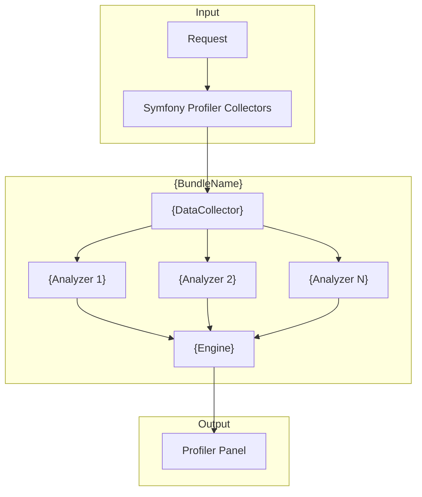
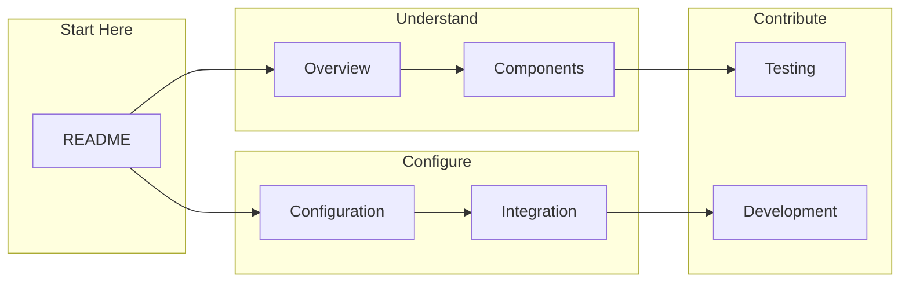

# {BundleName} Documentation

> {BriefDescription}

## Quick Navigation

```mermaid
mindmap
  root((Documentation))
    Overview
      Architecture
      Tech Stack
      Glossary
    Components
      {Component1}
      {Component2}
      {Component3}
    Configuration
      Parameters
      Examples
    Integration
      Installation
      Optional Deps
      Extending
    Testing
      Strategy
      Coverage
    Development
      Standards
      Contributing
```

---

## Getting Started

| I want to...                  | Start here                                              |
| ----------------------------- | ------------------------------------------------------- |
| Install the bundle            | [Installation](integration/index.md)                    |
| Understand the architecture   | [Architecture Overview](overview/architecture.md)       |
| Configure the bundle          | [Configuration Reference](configuration/index.md)      |
| Extend or customize behavior  | [Extending](integration/extending.md)                   |
| Run the test suite            | [Testing Strategy](testing/index.md)                    |
| Contribute to the bundle      | [Contributing](development/index.md)                    |

---

## Documentation by Role

### For Bundle Users

| Topic               | Documentation                                          |
| ------------------- | ------------------------------------------------------ |
| Installation        | [Installation](integration/index.md)                   |
| Configuration       | [Configuration Reference](configuration/index.md)     |
| Optional Deps       | [Optional Dependencies](integration/optional-deps.md) |
| Extension Points    | [Extending](integration/extending.md)                  |

### For Contributors

| Topic               | Documentation                                          |
| ------------------- | ------------------------------------------------------ |
| Architecture        | [Architecture Overview](overview/architecture.md)      |
| Components          | [Component Catalog](components/index.md)               |
| Coding Standards    | [Coding Standards](development/coding-standards.md)    |
| Testing             | [Testing Strategy](testing/index.md)                   |
| ADRs                | [Architecture Decisions](architecture/adr/index.md)    |

---

## Bundle at a Glance



---

## Key Metrics

| Metric          | Count | Documentation                          |
| --------------- | ----- | -------------------------------------- |
| Source Files    | {N}   | [Components](components/index.md)      |
| Components      | {N}   | [Component Catalog](components/index.md) |
| Detection Rules | {N}   | [Engine](components/{engine}.md)       |
| Test Files      | {N}   | [Testing](testing/index.md)            |

---

## Technology Stack

| Category       | Technology     | Version | Documentation                          |
| -------------- | -------------- | ------- | -------------------------------------- |
| Language       | PHP            | {X.Y}+  | [Tech Stack](overview/tech-stack.md)   |
| Framework      | Symfony        | {X.Y}+  | [Tech Stack](overview/tech-stack.md)   |
| Optional       | {Package}      | {X.Y}+  | [Optional Deps](integration/optional-deps.md) |

---

## Navigation Map



---

## Quick Links

### Most Used

- [Installation](integration/index.md)
- [Configuration Reference](configuration/index.md)
- [Component Catalog](components/index.md)

### Reference

- [Architecture Decisions](architecture/adr/index.md)
- [Optional Dependencies](integration/optional-deps.md)
- [Testing Strategy](testing/index.md)
- [Coding Standards](development/coding-standards.md)
