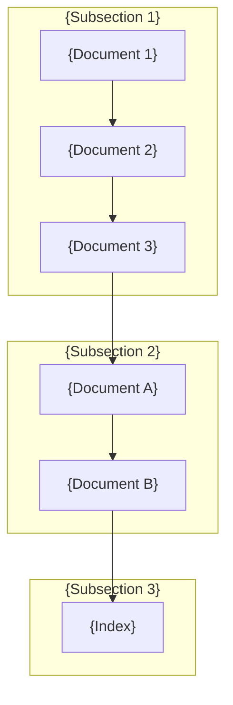

[Home](../README.md)

---

# {Section Name}

## Section Contents

### {Subsection 1}

| Document                        | Description                        |
| ------------------------------- | ---------------------------------- |
| [{Document 1}]({doc1}.md)       | {Brief description}                |
| [{Document 2}]({doc2}.md)       | {Brief description}                |
| [{Document 3}]({doc3}.md)       | {Brief description}                |

### {Subsection 2}

| Document                  | Description                         |
| ------------------------- | ----------------------------------- |
| [{Document A}]({docA}.md) | {Brief description}                 |
| [{Document B}]({docB}.md) | {Brief description}                 |

### {Subsection 3}

| Document                    | Description                     |
| --------------------------- | ------------------------------- |
| [{Index}]({sub}/index.md)   | All items overview              |

## Reading Path

**Recommended order:**

1. **{Subsection 1}** - {Why to start here}
    - [{Document 1}]({doc1}.md) -> [{Document 2}]({doc2}.md) -> [{Document 3}]({doc3}.md)
2. **[{Subsection 2}]({docA}.md)** - {What you'll learn}
3. **[{Subsection 3}]({sub}/index.md)** - {What these documents cover}

## {Optional: Quick Reference Table}

| Item                         | Title      | Status   |
| ---------------------------- | ---------- | -------- |
| [{Item 1}]({sub}/{item1}.md) | {Title 1}  | Accepted |
| [{Item 2}]({sub}/{item2}.md) | {Title 2}  | Accepted |
| [{Item 3}]({sub}/{item3}.md) | {Title 3}  | Proposed |

## Related Sections

- [{Related 1}](../{related1}/index.md) - {How it relates}
- [{Related 2}](../{related2}/index.md) - {How it relates}
- [{Related 3}](../{related3}/index.md) - {How it relates}

---

## Navigation

| Previous | Up | Next |
|:---------|:--:|-----:|
| [{Previous Section}](../{prev}/index.md) | [Home](../README.md) | [{Next Section}](../{next}/index.md) |
