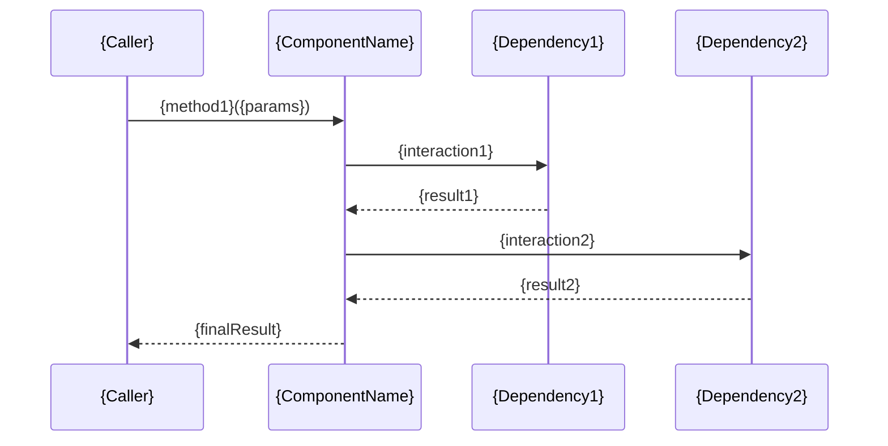

[Home](../../README.md) > [Components](index.md) > **{ComponentName}**

---

# {ComponentName}

## Overview

{Brief description of what this component does and its role in the bundle.}

```mermaid
mindmap
  root(({ComponentName}))
    {Responsibility 1}
      {Detail 1.1}
      {Detail 1.2}
    {Responsibility 2}
      {Detail 2.1}
      {Detail 2.2}
    {Responsibility 3}
      {Detail 3.1}
```

## Public API

| Method | Parameters | Return Type | Description |
|--------|------------|-------------|-------------|
| `{method1}()` | `{ParamType} ${param}` | `{ReturnType}` | {What the method does} |
| `{method2}()` | `{ParamType} ${param}` | `{ReturnType}` | {What the method does} |
| `{method3}()` | -- | `{ReturnType}` | {What the method does} |

## Class Diagram

```mermaid
classDiagram
    class {InterfaceName} {
        <<interface>>
        +{method1}({param}): {ReturnType}
    }

    class {AbstractClass} {
        <<abstract>>
        #{sharedMethod}(): {ReturnType}
    }

    class {ComponentName} {
        -{property1}: {Type}
        -{property2}: {Type}
        +{method1}({param}): {ReturnType}
        +{method2}({param}): {ReturnType}
    }

    class {RelatedClass} {
        +{method}(): {ReturnType}
    }

    {InterfaceName} <|.. {AbstractClass}
    {AbstractClass} <|-- {ComponentName}
    {ComponentName} --> {RelatedClass}
```

## Configuration

Parameters that affect this component:

| Parameter | Type | Default | Effect |
|-----------|------|---------|--------|
| `{param1}` | {type} | `{default}` | {How it affects this component} |
| `{param2}` | {type} | `{default}` | {How it affects this component} |

## Data Flow



## Key Behaviors

### {Behavior 1}

{Description of an important behavior or processing rule:}
- {Detail 1}
- {Detail 2}
- {Detail 3}

### {Behavior 2}

{Description of another important behavior:}
- {Detail 1}
- {Detail 2}

### {Behavior 3}

{Description of edge case handling or special behavior:}
- {Detail 1}
- {Detail 2}

## Related Components

- [{RelatedComponent1}]({related1}.md) - {How it relates}
- [{RelatedComponent2}]({related2}.md) - {How it relates}
- [Configuration Reference](../configuration/index.md) - Parameters affecting this component

---

## Navigation

| Previous | Up | Next |
|:---------|:--:|-----:|
| [{PreviousComponent}]({prev}.md) | [Components](index.md) | [{NextComponent}]({next}.md) |
