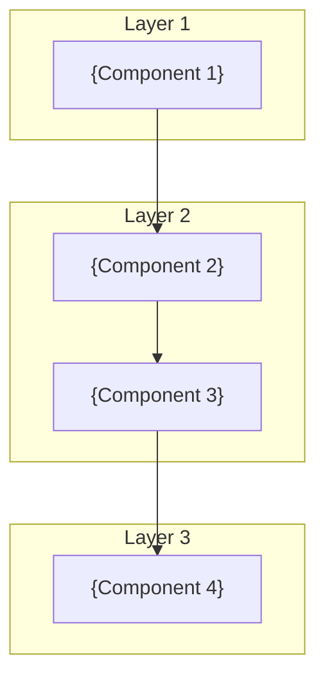

[Home](../../README.md) > [Architecture](../index.md) > [ADR](index.md) > **ADR-{NNNN}**

---

# ADR-{NNNN}: {Title}

## Status

{Proposed | Accepted | Deprecated | Superseded by ADR-XXXX}

## Context

{Describe the problem or situation that requires a decision. Include:}
- The forces at play (technical, business, team constraints)
- The requirements that need to be met
- Any relevant background information

Example:
> The application requires a maintainable, testable architecture that:
> - Supports {N} API endpoints across multiple domains
> - Enables independent testing of each layer
> - Allows new developers to quickly understand the codebase
> - Maintains consistency across all domain areas

## Decision

{Describe the decision and rationale. Include:}
- What approach was chosen
- Why this approach was selected over alternatives
- High-level implementation details

### Architecture Overview

### Key Principles

| Principle | Description                    | Implementation           |
| --------- | ------------------------------ | ------------------------ |
| {Name 1}  | {What this principle ensures}  | {How it's implemented}   |
| {Name 2}  | {What this principle ensures}  | {How it's implemented}   |

## Consequences

### Positive

- **{Benefit 1}**: {Description of positive outcome}
- **{Benefit 2}**: {Description of positive outcome}
- **{Benefit 3}**: {Description of positive outcome}

### Negative

- **{Drawback 1}**: {Description of negative outcome}
- **{Drawback 2}**: {Description of negative outcome}
- **{Drawback 3}**: {Description of negative outcome}

### Neutral

- {Observation that is neither positive nor negative}

## Alternatives Considered

### {Alternative 1}

{Brief description of alternative and why it was rejected.}

### {Alternative 2}

{Brief description of alternative and why it was rejected.}

## References

- `{path/to/relevant/file.ext}` - {Description}
- `{path/to/another/file.ext}` - {Description}
- [{External Resource}]({URL}) - {Description}

---

## Navigation

| Previous | Up | Next |
|:---------|:--:|-----:|
| [ADR-{NNNN-1}](ADR-{NNNN-1}.md) | [ADR Index](index.md) | [ADR-{NNNN+1}](ADR-{NNNN+1}.md) |
