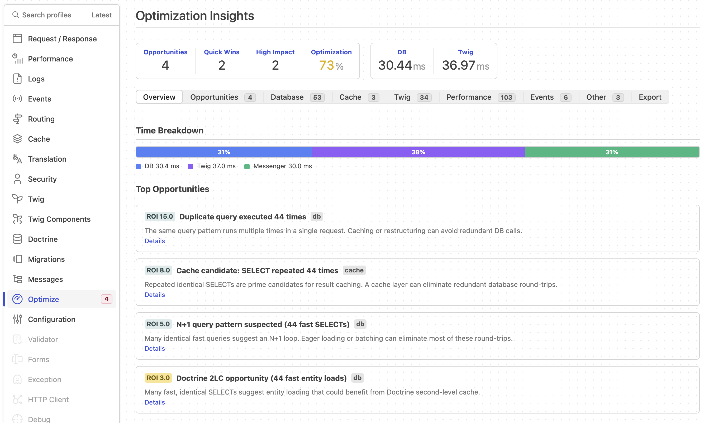

# Symfony Profiler Optimization Advisor Bundle

[](https://github.com/martinkup/symfony-profiler-optimization-advisor-bundle/actions)
[](https://packagist.org/packages/martinkup/symfony-profiler-optimization-advisor-bundle)
[](https://packagist.org/packages/martinkup/symfony-profiler-optimization-advisor-bundle)
[](LICENSE)
[](composer.json)
[](composer.json)
[](phpstan.neon.dist)

> **Detect N+1 queries, slow SQL, low cache hit rates, hot Twig templates, and 10 more performance anti-patterns** — automatically, on every request. Each finding is scored by impact, effort, and confidence, with a ready-to-use AI prompt for guided fixes. Queryable directly from **Claude Code** and other MCP-compatible AI agents via [AI Mate integration](#ai-mate-integration).



A **meta data collector** for Symfony Profiler — it reads data from other profiler collectors (Doctrine, Cache, Twig, Events, HTTP Client, Messenger, Stopwatch), analyzes **per-request signals** across 7 categories, and produces **scored, actionable optimization opportunities** with impact/effort/confidence ratings, ROI ranking, and ready-to-use AI agent prompts.

## Table of Contents

- [Features](#features)
- [Why This Bundle?](#why-this-bundle)
- [How It Works](#how-it-works)
- [Requirements](#requirements)
- [Installation](#installation)
- [Configuration](#configuration)
- [Signal Categories](#signal-categories)
- [Detected Opportunity Codes](#detected-opportunity-codes)
- [Opportunity Scoring Model](#opportunity-scoring-model)
- [Origin Classification](#origin-classification)
- [Optional Integrations](#optional-integrations)
- [AI Mate Integration](#ai-mate-integration)
- [Architecture](#architecture)
- [Testing](#testing)
- [Documentation](#documentation)
- [Contributing](#contributing)
- [License](#license)

## Features

- **7 signal categories** — Database, Cache, Twig, Events, HTTP Client, Messenger, and Stopwatch
- **14 detection rules** — N+1 queries, duplicate queries, slow templates, low cache hit rates, heavy sync handlers, and more
- **Scored opportunities** — Each finding carries impact (1-5), effort (1-5), confidence (1-5), ROI, and risk level
- **AI agent prompts** — Every opportunity includes a ready-to-use prompt for AI coding assistants
- **MCP tool** — Queryable directly from Claude Code, Cursor, and other MCP-compatible AI agents via [AI Mate](#ai-mate-integration)
- **Origin classification** — Separates your app code signals from framework/infrastructure noise
- **Zero configuration** — Works out of the box with sensible defaults; every threshold is customizable
- **Late collector** — Runs at priority `-100` to ensure all other profiler collectors have finished first

## Why This Bundle?

Unlike generic APM tools, this bundle:
- Runs **inside the Symfony Profiler** — no external service needed
- Analyzes **7 signal categories** in a single per-request pass
- **Scores** each finding (impact/effort/confidence/ROI) instead of just listing warnings
- Generates **AI-ready prompts** for every opportunity
- **Directly queryable** from Claude Code, Cursor, and other MCP-compatible agents via AI Mate
- Classifies signals by **origin** (app vs. framework noise)
- Works with **zero configuration** out of the box

## How It Works

1. The `OptimizationAdvisorDataCollector` runs as a **late data collector** (priority `-100`) after all other Symfony profiler collectors have completed.
2. Seven specialized **analyzers** process raw profiling data from Doctrine, Cache, Twig Profiler, EventDispatcher, HttpClient, Messenger, and Stopwatch.
3. Each analyzer classifies signals by **origin** (app, infrastructure, or profiler) so you only see findings relevant to your code.
4. The **AdvisorEngine** evaluates all signals against configurable thresholds and produces scored optimization opportunities.
5. Opportunities are **deduplicated by fingerprint**, sorted by **ROI descending**, and capped at `max_items`.
6. The profiler panel renders a rich dashboard with summary scores, quick wins, high-impact findings, and detailed signal breakdowns.
7. Every opportunity includes a pre-filled **AI agent prompt** — copy it into your AI coding assistant for guided, step-by-step implementation.

## Requirements

| Dependency | Version      |
|------------|--------------|
| PHP        | >= 8.3       |
| Symfony    | 7.2+ or 8.0+ |

## Installation

```bash
composer require --dev martinkup/symfony-profiler-optimization-advisor-bundle
```

If you use [Symfony Flex](https://github.com/symfony/flex), the bundle is registered automatically. Otherwise, add it manually:

```php
// config/bundles.php
return [
    // ...
    MartinKup\OptimizationAdvisorBundle\OptimizationAdvisorBundle::class => ['dev' => true, 'test' => true],
];
```

> **Note:** Register the bundle only in `dev` and `test` environments. It depends on debug services (`twig.profile`, `data_collector.cache`) that are not available in production. Optional services (`doctrine.debug_data_holder`, `data_collector.http_client`, `debug.stopwatch`) are wired with `nullOnInvalid()` and degrade gracefully when absent.

## Configuration

All options have sensible defaults. No configuration file is needed to get started.

To customize, create `config/packages/optimization_advisor.yaml`:

```yaml
optimization_advisor:

    # Detection thresholds
    thresholds:
        slow_query_ms: 30.0        # Query groups slower than this trigger PG_SLOW_QUERY_GROUP
        n_plus_one_count: 10       # Minimum identical fast SELECTs to suspect N+1
        slow_listener_ms: 10.0     # Event listeners slower than this trigger EVENTS_SLOW_LISTENER
        max_items: 200             # Maximum number of opportunities reported per request

    # Your application's root namespace prefix (used to classify signals as "app" vs "infra")
    app_namespace_prefix: 'App\'

    # Database tables considered infrastructure (excluded from app signal analysis)
    infra_db_tables:
        - doctrine_migration_versions

    # Cache pool name prefixes classified as "app" pools
    app_cache_pool_prefixes:
        - cache.app
        - cache.doctrine.result
        - cache.doctrine.orm

    # Cache pool name prefixes classified as "profiler" pools (excluded from totals)
    profiler_cache_pool_prefixes:
        - cache.profiler

    # Twig template name prefixes classified as "profiler" templates
    profiler_template_prefixes:
        - '@WebProfiler/'

    # Event listener namespace prefixes classified as "profiler" listeners
    profiler_event_namespace_prefixes:
        - 'Symfony\Bundle\WebProfilerBundle\'

    # Specific listener classes classified as "profiler"
    profiler_event_classes:
        - 'Symfony\Component\HttpKernel\EventListener\ProfilerListener'

    # Security redaction for AI Mate / MCP output (enabled by default)
    redact_sensitive_data: true

    # Parameter key substrings that trigger redaction (case-insensitive substring match)
    sensitive_param_patterns:
        - email
        - password
        - passwd
        - token
        - secret
        - auth
        - credential
        - phone
        - address
        - ssn
        - card
        - iban

    # Regex patterns matched against parameter values (case-insensitive)
    sensitive_value_patterns:
        - '[^@\s]+@[^@\s]+\.[^@\s]+'   # email addresses

    # Query parameter names redacted from URIs (case-insensitive exact match)
    sensitive_query_params:
        - token
        - api_key
        - apikey
        - secret
        - password
        - auth
        - access_token
        - refresh_token
        - session_id
        - _token
        - email
        - session
        - cookie
```

### Security Redaction

When [AI Mate integration](#ai-mate-integration) is active, all profiler data passes through `SecurityRedactor` before being exposed via MCP channels (both the collector formatter and the MCP tool apply redaction for defense-in-depth). The redactor uses **pattern-based matching** to selectively redact sensitive values while preserving non-sensitive context (pagination, sorting, IDs).

**Fail-closed regex behavior:** Invalid regex patterns in `sensitive_value_patterns` cause values to be redacted rather than skipped. This ensures misconfigured patterns cannot leak sensitive data.

**What gets redacted:**

| Data path                                  | Redaction rule                                                                                                                            |
|--------------------------------------------|-------------------------------------------------------------------------------------------------------------------------------------------|
| `origin.uri` path segments                 | Segments matching a `sensitive_value_patterns` regex (e.g., email in path)                                                                |
| `origin.uri` query params                  | Params matching `sensitive_query_params` (exact), `sensitive_param_patterns` (key substring), or `sensitive_value_patterns` (value regex) |
| `signals.db.query_groups[].example_sql`    | Always replaced with normalized `pattern` (parameterized SQL)                                                                             |
| `signals.db.query_groups[].example_params` | Values where the key contains a `sensitive_param_patterns` substring, or the value matches a `sensitive_value_patterns` regex             |

**Example:**

```
# Input
origin.uri: /api/users/john@example.com/profile?token=abc123&page=2&sort=name
example_params: {email: 'admin@ex.com', 0: 'admin@ex.com', 1: 42, name: 'John'}
example_sql: "SELECT * FROM users WHERE email = 'admin@example.com'"

# Output (with default patterns)
origin.uri: /api/users/***REDACTED***/profile?token=***REDACTED***&page=2&sort=name
example_params: {email: ***REDACTED***, 0: ***REDACTED***, 1: 42, name: 'John'}
example_sql: "SELECT * FROM users WHERE email = ?"    ← pattern
```

- `email` key → redacted by `sensitive_param_patterns` (substring match)
- `0: 'admin@ex.com'` → redacted by `sensitive_value_patterns` (email regex)
- `1: 42` → preserved (no pattern match)
- `name: 'John'` → preserved (no pattern match)
- `token` query param → redacted by `sensitive_query_params` (exact match)
- `page`, `sort` query params → preserved

To add custom patterns (e.g. for SSN or national ID numbers):

```yaml
optimization_advisor:
    sensitive_param_patterns:
        - email
        - password
        - token
        - ssn
        - national_id
    sensitive_value_patterns:
        - '[^@\s]+@[^@\s]+\.[^@\s]+'    # email addresses
        - '\d{3}-\d{2}-\d{4}'           # US SSN format
    sensitive_query_params:
        - token
        - api_key
        - secret
        - session_id
```

> **Note:** Setting any of these arrays replaces the defaults entirely. Include all patterns you need.
>
> In query strings, redacted values are URL-encoded (`%2A%2A%2AREDACTED%2A%2A%2A`). The examples above show the decoded form for readability.

### Configuration Reference

**Thresholds**

| Option | Type | Default | Description |
|--------|------|---------|-------------|
| `thresholds.slow_query_ms` | `float` | `30.0` | Min ms for slow query group |
| `thresholds.n_plus_one_count` | `int` | `10` | Min identical SELECTs for N+1 |
| `thresholds.slow_listener_ms` | `float` | `10.0` | Min ms for slow listener |
| `thresholds.max_items` | `int` | `200` | Max opportunities per request |

**Origin classification**

| Option | Type | Default | Description |
|--------|------|---------|-------------|
| `app_namespace_prefix` | `string` | `App\` | Root namespace for "app" origin |
| `infra_db_tables` | `string[]` | `[doctrine_migration_versions]` | Infrastructure DB tables |
| `app_cache_pool_prefixes` | `string[]` | `[cache.app, ...]` | App cache pool prefixes |
| `profiler_cache_pool_prefixes` | `string[]` | `[cache.profiler]` | Profiler cache pool prefixes |
| `profiler_template_prefixes` | `string[]` | `[@WebProfiler/]` | Profiler Twig template prefixes |
| `profiler_event_namespace_prefixes` | `string[]` | `[...WebProfilerBundle\]` | Profiler listener namespaces |
| `profiler_event_classes` | `string[]` | `[...\ProfilerListener]` | Profiler listener classes |

**Security redaction** (AI Mate / MCP output)

| Option | Type | Default | Description |
|--------|------|---------|-------------|
| `redact_sensitive_data` | `bool` | `true` | Enable redaction |
| `sensitive_param_patterns` | `string[]` | `[email, password, ...]` | Param key substrings to redact |
| `sensitive_value_patterns` | `string[]` | `[email regex]` | Regex patterns on param values |
| `sensitive_query_params` | `string[]` | `[token, api_key, ...]` | URI query params to redact |

## Signal Categories

### Database (`DatabaseAnalyzer`)

Analyzes Doctrine DBAL debug data. Groups queries by SQL fingerprint (normalized pattern), classifies origin, and computes per-group metrics.

**Collected metrics:** query count, total/max/min/avg ms, query kind (SELECT/INSERT/UPDATE/DELETE), tables, connection name, fingerprint, app vs. infrastructure split.

### Cache (`CacheAnalyzer`)

Analyzes Symfony Cache pool statistics. Computes per-pool hit rates, read/write/delete counts, and classifies pools by origin.

**Collected metrics:** calls, reads, writes, deletes, hits, misses, hit rate, total ms, app/infra/profiler split.

### Twig (`TwigAnalyzer`)

Walks the Twig `Profile` tree and aggregates per-template render counts and durations.

**Collected metrics:** render count, total/max ms per template, app/infra/profiler render split.

### Events (`EventAnalyzer`)

Analyzes called and not-called event listeners from `TraceableEventDispatcher`. Groups by event + listener class.

**Collected metrics:** call count, total/max/avg ms per listener, unique events, unique listeners, not-called count, app/infra/profiler split.

### HTTP Client (`HttpClientAnalyzer`)

Analyzes `HttpClientDataCollector` traces. Groups by endpoint fingerprint (method + host + path pattern with numeric segments replaced by `{id}`).

**Collected metrics:** call count, total/max ms, status code buckets (2xx/3xx/4xx/5xx) per endpoint.

### Messenger (`OtherSignalsAnalyzer`)

Analyzes synchronous Messenger handler executions from `TraceRegistry` records.

**Collected metrics:** handler class, message name, duration ms, app/infra split, total sync ms.

### Stopwatch (`PerformanceAnalyzer`)

Analyzes Symfony Stopwatch section events for a performance timeline breakdown.

**Collected metrics:** event name, category, duration, memory, start/end time, period count, percent of total request duration, top 3 events.

## Detected Opportunity Codes

| Code                         | Category  | Trigger                                                  | Default Threshold           |
|------------------------------|-----------|----------------------------------------------------------|-----------------------------|
| `PG_SLOW_QUERY_GROUP`        | DB        | Query group total time exceeds threshold                 | 30 ms                       |
| `PG_N_PLUS_ONE_SUSPECTED`    | DB        | Many identical fast SELECTs (avg < 5 ms)                 | 10 queries                  |
| `PG_DUPLICATE_QUERY`         | DB        | Same query pattern executed multiple times               | 3 executions                |
| `PG_LARGE_RESULTSET`         | DB        | Single slow SELECT (> 100 ms) with low repetition        | 100 ms, <= 3 times          |
| `CACHE_CANDIDATE_DB_RESULTS` | Cache     | Repeated identical SELECTs suitable for caching          | 3 executions                |
| `CACHE_LOW_HITRATE_POOL`     | Cache     | Cache pool with low hit rate and significant volume      | < 50% hit rate, >= 10 calls |
| `DOCTRINE_2LC_OPPORTUNITY`   | DB        | Many fast identical SELECTs suitable for 2nd-level cache | 5 queries, avg < 2 ms       |
| `TWIG_HOT_TEMPLATE`          | Twig      | Template with high cumulative render time                | 50 ms total                 |
| `TWIG_DUP_RENDER`            | Twig      | Template rendered many times per request                 | 10 renders                  |
| `EVENTS_TOO_MANY_LISTENERS`  | Events    | Listener invoked excessively in a single request         | > 50 calls                  |
| `EVENTS_SLOW_LISTENER`       | Events    | Event listener with high max execution time              | 10 ms                       |
| `HTTP_SLOW_ENDPOINT`         | HTTP      | External HTTP call with high latency                     | 500 ms                      |
| `HTTP_DUP_CALL`              | HTTP      | Same external endpoint called multiple times             | 2 calls                     |
| `MESSENGER_SYNC_HEAVY`       | Messenger | Synchronous Messenger handler with high duration         | 50 ms                       |

## Opportunity Scoring Model

Each detected opportunity is scored on three dimensions (1-5 scale):

| Dimension      | Meaning                                                       |
|----------------|---------------------------------------------------------------|
| **Impact**     | How much performance improvement is expected                  |
| **Effort**     | How much work is required to implement the fix                |
| **Confidence** | How certain the detection is (higher = fewer false positives) |

Derived metrics:

- **ROI** = `impact * confidence / effort` — used for sorting (highest ROI first)
- **Quick Win** = `effort <= 2 AND confidence >= 4`
- **High Impact** = `impact >= 4`
- **Risk** = `low`, `med`, or `high` — safety risk of implementing the recommendation
- **Fingerprint** = `md5(code + evidence)` — used for deduplication

### Optimization Score

A 0-100 score summarizing the overall request health. Starts at 100 and deducts `impact * confidence * 0.5` per opportunity. Lower scores indicate more optimization potential.

### AI Agent Prompt

Every opportunity includes a structured `ai_prompt` field containing:

- Problem description
- Evidence references
- Numbered recommended actions
- Safety notes

This prompt can be copied directly into an AI coding assistant (Claude, ChatGPT, Copilot) for guided implementation.

## Origin Classification

All signals are classified into three origins to separate your application code from framework noise:

| Origin       | Meaning                          | Example                                                |
|--------------|----------------------------------|--------------------------------------------------------|
| **app**      | Your application code            | Queries on `users` table, `App\Listener\...` listeners |
| **infra**    | Framework/library infrastructure | Queries on `doctrine_migration_versions`, `pg_catalog` |
| **profiler** | Profiler overhead itself         | `cache.profiler` pool, `@WebProfiler/` templates       |

Only **app** signals are evaluated for opportunities. Infrastructure and profiler signals are collected for informational display but do not generate recommendations.

The `app_namespace_prefix` configuration option controls how event listeners and Messenger handlers are classified. Set it to your project's root namespace (e.g., `Acme\` for a project using `Acme\App\...` namespaces).

## Optional Integrations

The bundle gracefully degrades when optional components are not installed:

| Package                             | What it enables                         | Constructor behavior                                                              |
|-------------------------------------|-----------------------------------------|-----------------------------------------------------------------------------------|
| `symfony/doctrine-bridge`           | Database query analysis                 | `?DebugDataHolder` via `nullOnInvalid()` — panel shows empty DB section           |
| `doctrine/sql-formatter`            | SQL syntax highlighting in Database tab | Falls back to `SqlFormatterFallbackExtension` with basic formatting               |
| `symfony/http-client`               | HTTP Client call analysis               | `?HttpClientDataCollector` via `nullOnInvalid()` — panel shows empty HTTP section |
| `symfony/stopwatch`                 | Stopwatch performance breakdown         | `?Stopwatch` via `nullOnInvalid()` — panel shows empty performance section        |
| `symfony/messenger`                 | Synchronous handler analysis            | `MessageTracingMiddleware` auto-registered via CompilerPass; removed when absent  |
| `symfony/ai-symfony-mate-extension` | AI Mate MCP tool + collector formatter  | Enables `optimization-advisor-opportunities` MCP tool and profiler resource URI   |

### Messenger Integration

When `symfony/messenger` is installed, the bundle automatically registers its
`MessageTracingMiddleware` on all configured Messenger buses via a CompilerPass.
The middleware is inserted right after Symfony's `traceable` middleware (in debug mode)
or as the outermost wrapper in the chain for accurate timing.

This approach works reliably even when the host project defines environment-specific
middleware overrides (e.g., `when@dev` sections in `messenger.yaml`).

**No manual configuration required** — the middleware is auto-registered for every bus
tagged with `messenger.bus` regardless of how middleware lists are defined in configuration files.

The middleware populates the bundle's `TraceRegistry` with per-handler trace records:

- `is_handled_sync` — whether the message was handled synchronously (`HandledStamp` present)
- `handler_class` — FQCN of the handler (from `HandledStamp::getHandlerName()`)
- `handler_duration_ms` — wall-clock handler execution time
- `message_short` — short class name of the dispatched message

When `symfony/messenger` is not installed, the middleware definition is conditionally removed and the "Other" tab shows an empty Messenger section.

## AI Mate Integration

When [`symfony/ai-symfony-mate-extension`](https://github.com/symfony/ai-mate) is installed, the bundle registers as an **AI Mate MCP extension**, exposing optimization data to AI assistants via two channels:

### MCP Tool: `optimization-advisor-opportunities`

A dedicated tool that returns scored optimization opportunities with filtering support:

```
optimization-advisor-opportunities(
    token?: string,       # Profiler token (null = latest request)
    category?: string,    # Filter: db, cache, twig, events, http, messenger
    type?: string,        # Filter: quick_wins, high_impact, risky
    limit?: int = 20      # Max opportunities returned
)
```

Each opportunity includes `ai_prompt`, `recommended_actions`, `evidence_refs`, and `safety_notes` — ready for AI-guided implementation.

### Profiler Resource URI

The collector formatter makes optimization data available at:

```
symfony-profiler://profile/{token}/optimization_advisor
```

This returns the full collector output: `origin`, `opportunities`, `summary`, and `signals` with sanitized data objects.

### Setup

1. Install the extension as a dev dependency:

```bash
composer require --dev symfony/ai-symfony-mate-extension
```

2. Discover the extension:

```bash
bin/mate discover
```

3. Use the tool from any MCP-compatible AI assistant (e.g., Claude Code):

```
Use AI Mate to analyze optimization opportunities for
https://app.local/apple-iphone-18-pro and suggest their implementation.
```

The agent will automatically query the profiler for the matching request, evaluate all detected opportunities, and propose concrete code changes.

No additional configuration is required. The bundle's `composer.json` contains the `extra.ai-mate` section for automatic discovery.

## Architecture

Key components: **DataCollector** (late collector, priority -100) → **7 Analyzers** (Database, Cache, Twig, Events, HTTP Client, Messenger, Stopwatch) → **AdvisorEngine** (14 detection rules, scoring, deduplication). See the [full component catalog](docs/components/index.md) for details.

### Data Flow

```
Request → Symfony Profiler Collectors (Doctrine, Cache, Twig, Events, ...)
                    ↓
    OptimizationAdvisorDataCollector::lateCollect()
                    ↓
    ┌───────────────┼───────────────┐
    ↓               ↓               ↓
DatabaseAnalyzer  CacheAnalyzer  TwigAnalyzer  ... (7 analyzers)
    ↓               ↓               ↓
    └───────────────┼───────────────┘
                    ↓
              AdvisorEngine::evaluate()
                    ↓
        Scored Opportunities (ROI-sorted)
                    ↓
         Profiler Panel (Twig template)
```

## Documentation

Full documentation is available in the [`docs/`](docs/README.md) directory.

| Document                                               | Description                                                                                                |
|--------------------------------------------------------|------------------------------------------------------------------------------------------------------------|
| [Architecture Overview](docs/overview/architecture.md) | Data flow, request lifecycle, origin classification, scoring model                                         |
| [Component Catalog](docs/components/index.md)          | All 26 source classes with API reference and diagrams                                                      |
| [Configuration Reference](docs/configuration/index.md) | All 16 parameters with types, defaults, and examples                                                       |
| [Integration Guide](docs/integration/index.md)         | Installation, optional dependencies, extension points                                                      |
| [ADRs](docs/architecture/adr/index.md)                 | Architectural decision records (late collector, origin classification, messenger pass, security redaction) |

## Testing & Development

```bash
# Install dependencies
composer install

# Run all quality gates (lint → fix → cs → stan → test)
composer check
```

All available commands via `composer run --list`:

| Command                             | Description                                                          |
|-------------------------------------|----------------------------------------------------------------------|
| `composer cs`                       | Check coding standards (PHP_CodeSniffer + Slevomat)                  |
| `composer fix`                      | Auto-fix coding standard violations                                  |
| `composer stan`                     | Run PHPStan static analysis (level max)                              |
| `composer test`                     | Run PHPUnit test suite                                               |
| `composer test:filter -- ClassName` | Run filtered tests (e.g. `composer test:filter -- DatabaseAnalyzer`) |
| `composer test:unit`                | Run only unit tests                                                  |
| `composer test:coverage`            | Run tests with text coverage output (requires pcov)                  |
| `composer test:coverage-html`       | Generate HTML coverage report in `coverage/`                         |
| `composer check`                    | Run full QA pipeline: lint → fix → cs → stan → test                  |

## Contributing

See [CONTRIBUTING.md](CONTRIBUTING.md) for guidelines.

## License

This bundle is released under the [MIT License](LICENSE).

## Author

[Martin Kup](https://martinkup.dev) · [LinkedIn](https://www.linkedin.com/in/martinkup/)
