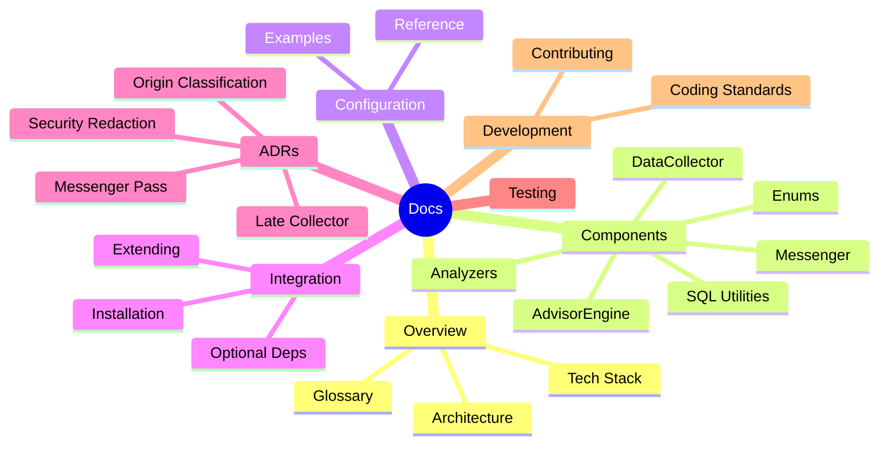
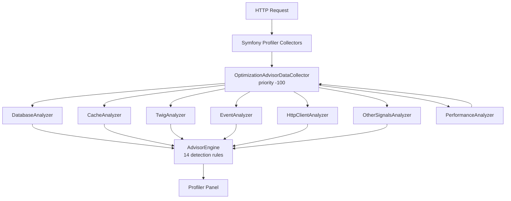
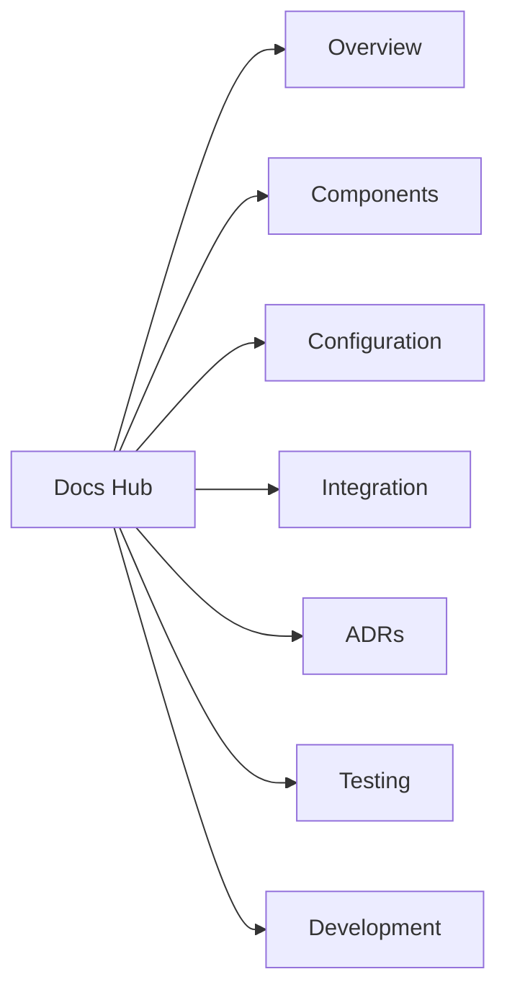

# Documentation Hub

> **Symfony Profiler Optimization Advisor Bundle** — Analyzes per-request profiling signals across 7 categories and produces scored, actionable optimization opportunities with AI agent prompts.

## Getting Started

| I want to...                     | Read                                              |
|----------------------------------|---------------------------------------------------|
| Understand the architecture      | [Architecture Overview](overview/architecture.md) |
| Install the bundle               | [Installation & Setup](integration/index.md)      |
| Configure thresholds and filters | [Configuration Reference](configuration/index.md) |
| Learn about detection rules      | [AdvisorEngine](components/advisor-engine.md)     |
| Contribute code                  | [Development Guide](development/index.md)         |

## Documentation by Role

**User** — Start with [Installation](integration/index.md), then [Configuration](configuration/index.md) and [Configuration Examples](configuration/examples.md).

**Contributor** — Read [Architecture](overview/architecture.md), then [Components](components/index.md), [Testing](testing/index.md) and [Development](development/index.md).

## Bundle at a Glance

## Key Metrics

| Metric                   | Count                                                      |
|--------------------------|------------------------------------------------------------|
| Source files             | 26 (25 PHP + 1 DI config)                                  |
| Analyzers                | 7                                                          |
| Detection rules          | 14                                                         |
| Enums                    | 4 (DataOrigin, OpportunityCode, OpportunityCategory, Risk) |
| Configuration parameters | 16                                                         |
| Test files               | 25                                                         |

## Technology Stack

| Component       | Version           |
|-----------------|-------------------|
| PHP             | >= 8.3            |
| Symfony         | 7.2+ / 8.0+       |
| PHPUnit         | 12                |
| PHPStan         | level max         |
| Coding standard | PSR-12 + Slevomat |

## Navigation

## Quick Links

- [Architecture](overview/architecture.md) | [Tech Stack](overview/tech-stack.md) | [Glossary](overview/glossary.md)
- [DataCollector](components/data-collector.md) | [AdvisorEngine](components/advisor-engine.md) | [Analyzers](components/analyzers.md) | [Enums](components/enums.md)
- [Configuration Reference](configuration/index.md) | [Examples](configuration/examples.md)
- [Installation](integration/index.md) | [Optional Dependencies](integration/optional-deps.md) | [Extending](integration/extending.md)
- [ADR Index](architecture/adr/index.md)
- [Testing Guide](testing/index.md)
- [Contributing](development/index.md) | [Coding Standards](development/coding-standards.md)

---

[Next: Overview &rarr;](overview/index.md)
