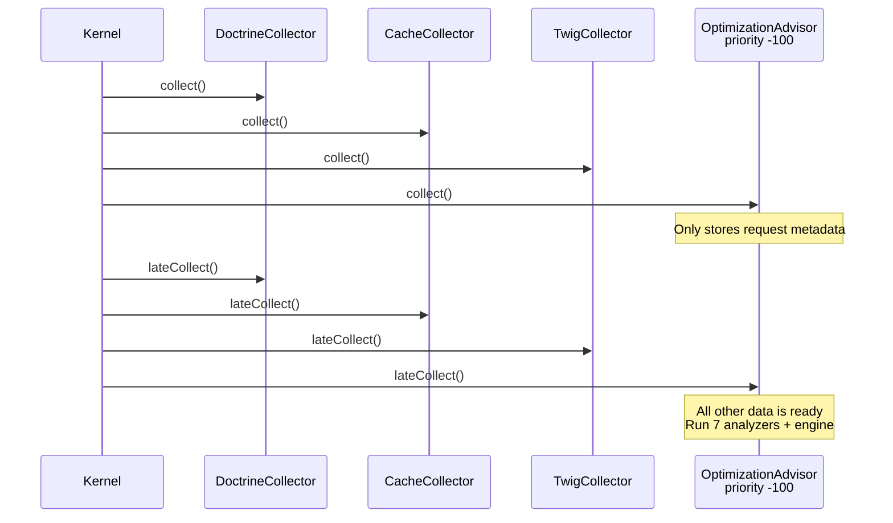

# ADR-0001: Late Data Collector Priority

[Docs Hub](../../README.md) / [ADRs](index.md) / **ADR-0001**

## Status

**Accepted**

## Context

The Optimization Advisor needs to analyze data from multiple Symfony profiler collectors (Doctrine, Cache, Twig, Events, HttpClient, Stopwatch). This data must be fully collected and available before analysis can begin.

Standard data collectors run during `collect()`, which is triggered during the kernel response event. However, some collectors (like `CacheDataCollector`) may not have final data at that point.

## Decision

Use `LateDataCollectorInterface` with `#[AutoconfigureTag('data_collector', ['priority' => -100])]` to ensure the Optimization Advisor runs after all other collectors.

The `collect()` method only stores request metadata (route, controller, method, URI). All analysis happens in `lateCollect()`, which runs in a separate pass after all normal and late collectors with higher priority have completed.

## Timing

## Consequences

- All profiler data is guaranteed to be available when analysis runs
- Priority `-100` provides a large margin — other bundles' late collectors (typically priority 0 or higher) complete first
- The `collect()` phase is minimal (stores 4 fields), keeping the critical path fast

## Alternatives Rejected

| Alternative                                      | Why Rejected                                               |
|--------------------------------------------------|------------------------------------------------------------|
| Normal collector (no LateDataCollectorInterface) | Other collectors' data not yet complete during `collect()` |
| `kernel.terminate` listener                      | Profiler has already serialized data by this point         |
| Higher priority (e.g., `-10`)                    | Risk of running before other late collectors               |

---

[&larr; ADR Index](index.md) | [Next: ADR-0002 &rarr;](0002-origin-classification.md)
