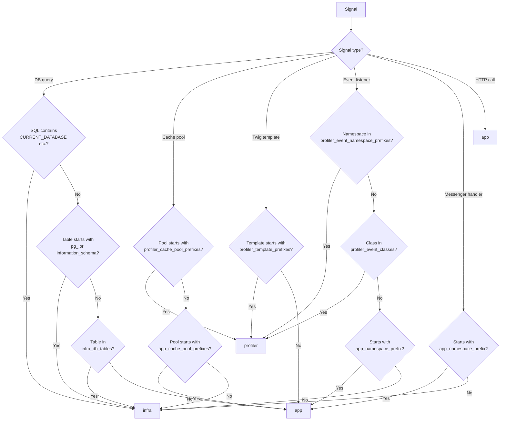

# ADR-0002: Origin Classification

[Docs Hub](../../README.md) / [ADRs](index.md) / **ADR-0002**

## Status

**Accepted**

## Context

Raw profiler data contains signals from three distinct sources:

1. **Application code** — queries, cache calls, template renders, and event listeners belonging to the user's project
2. **Framework infrastructure** — Doctrine migrations, Symfony internal listeners, system catalog queries
3. **Profiler overhead** — the WebProfiler's own cache calls, templates, and listeners

Without classification, the noise from framework and profiler signals drowns out actionable findings from the user's code.

## Decision

Implement a three-tier origin classification system: `app`, `infra`, and `profiler`. Only `app`-origin signals are evaluated by the AdvisorEngine to generate opportunities.

Each analyzer applies classification rules specific to its signal type:

## Consequences

- Users only see opportunities relevant to their code
- Infrastructure and profiler signals are still collected for informational display
- All classification rules are configurable via bundle parameters
- The `app_namespace_prefix` setting (`App\` by default) must match the project's root namespace

## Alternatives Rejected

| Alternative                | Why Rejected                                                                                                                  |
|----------------------------|-------------------------------------------------------------------------------------------------------------------------------|
| Two-tier (app vs. non-app) | Cannot distinguish profiler overhead from framework infra — profiler cache calls would inflate infra metrics                  |
| No classification          | Too noisy — framework internals generate many false-positive opportunities (e.g., Doctrine migration queries flagged as slow) |
| Allowlist-only             | Too restrictive — new user code would need manual registration                                                                |

---

[&larr; ADR-0001](0001-late-data-collector-priority.md) | [Next: ADR-0003 &rarr;](0003-messenger-middleware-compiler-pass.md)
