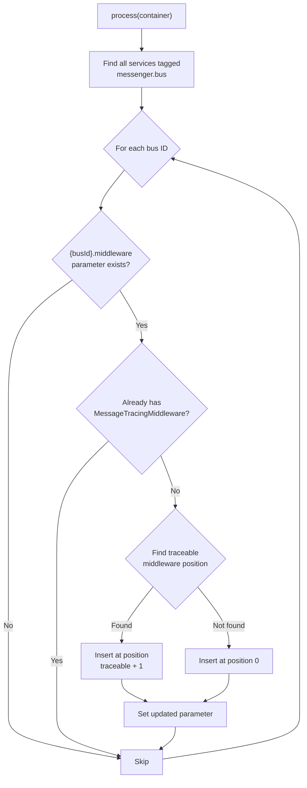

# ADR-0003: Messenger Middleware Compiler Pass

[Docs Hub](../../README.md) / [ADRs](index.md) / **ADR-0003**

## Status

**Accepted**

## Context

The bundle needs to trace synchronous Messenger handler executions to detect heavy sync handlers (`MESSENGER_SYNC_HEAVY`). This requires inserting `MessageTracingMiddleware` into every configured Messenger bus's middleware chain.

Two challenges:

1. Users should not need to manually configure the middleware
2. Projects commonly use `when@dev` sections in `messenger.yaml` that override the entire middleware list, which would drop any middleware added via `prependExtension()`

## Decision

Use a `CompilerPass` registered with `PassConfig::TYPE_BEFORE_OPTIMIZATION` at priority `1` that discovers all buses tagged with `messenger.bus` and programmatically inserts the middleware.

### Compiler Pass Logic

### Safety Guards

1. **Conditional registration:** The CompilerPass is only added in `build()` when `MiddlewareInterface` class exists
2. **Conditional service:** The middleware definition is removed in `loadExtension()` when `symfony/messenger` is not installed
3. **Idempotency check:** Skips buses where the middleware is already registered

### Insertion Position

The middleware is inserted right after Symfony's `traceable` middleware (which wraps middleware for debug data collection). If `traceable` is not in the chain, the middleware is inserted at position 0 (outermost).

## Consequences

- Zero manual configuration required
- Works reliably with `when@dev` overrides because the CompilerPass runs after all configuration is merged
- Idempotent — safe to have multiple passes or re-runs
- Gracefully absent when `symfony/messenger` is not installed

## Alternatives Rejected

| Alternative                              | Why Rejected                                                                          |
|------------------------------------------|---------------------------------------------------------------------------------------|
| Manual configuration in `messenger.yaml` | Error-prone, requires user action, easy to forget                                     |
| `prependExtension()`                     | Middleware list overridden by `when@dev` sections in user config                      |
| Kernel event listener                    | Cannot measure individual handler duration — middleware is the only integration point |

---

[&larr; ADR-0002](0002-origin-classification.md) | [Next: ADR-0004 &rarr;](0004-security-redaction-for-mcp-output.md)
