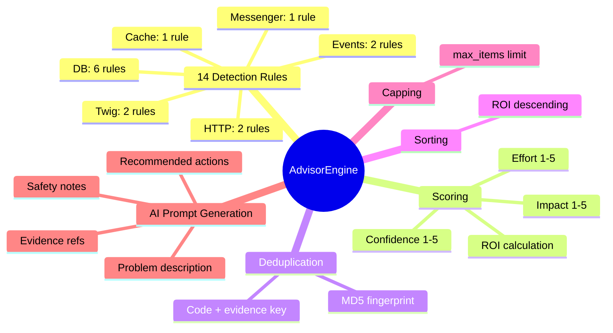
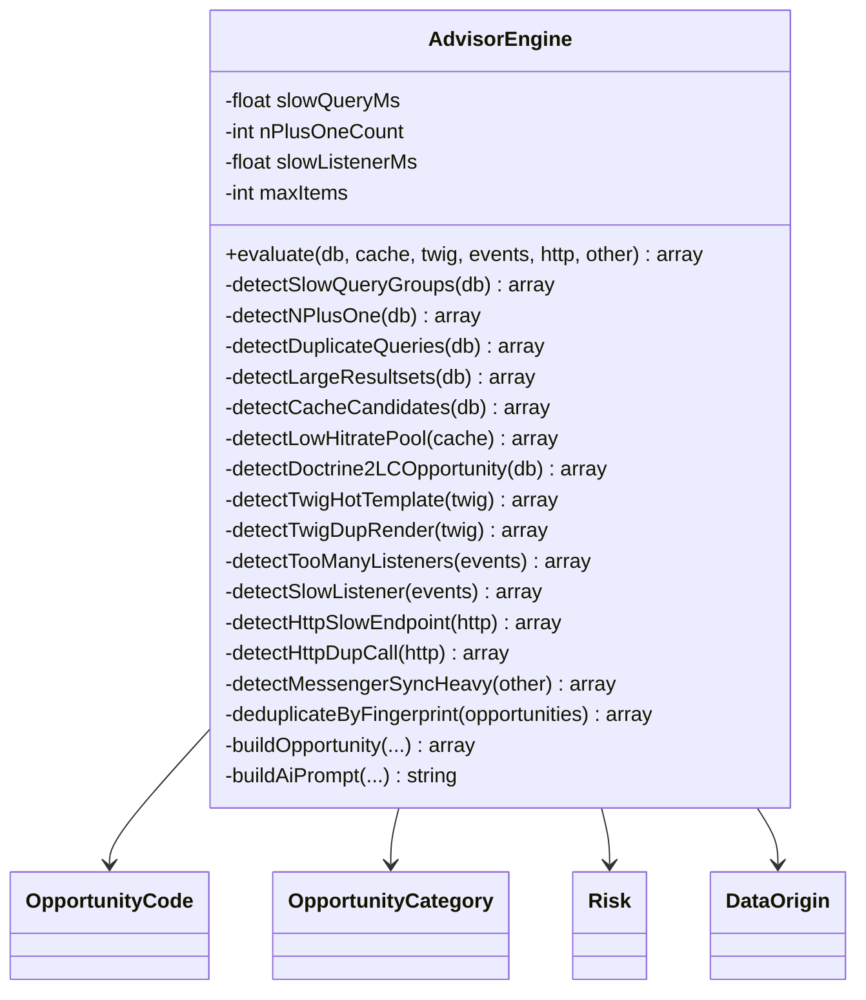
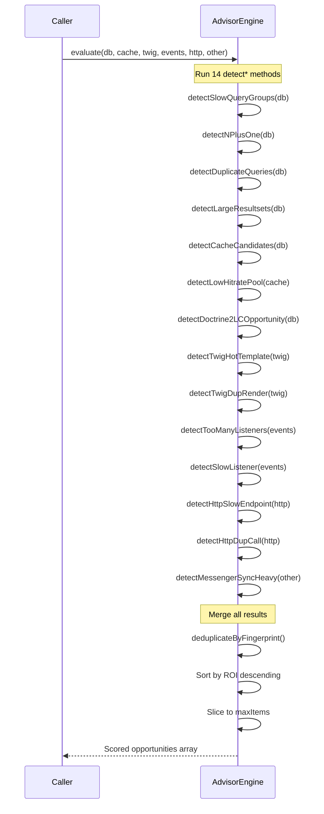

# AdvisorEngine

[Docs Hub](../README.md) / [Components](index.md) / **AdvisorEngine**

## Responsibilities



## Public API

| Method     | Signature                                                                                                                                  | Description                                                                  |
|------------|--------------------------------------------------------------------------------------------------------------------------------------------|------------------------------------------------------------------------------|
| `evaluate` | `evaluate(array $dbSignals, array $cacheSignals, array $twigSignals, array $eventSignals, array $httpSignals, array $otherSignals): array` | Runs all 14 detection rules, deduplicates, sorts by ROI, caps at `max_items` |

### Constructor Parameters

| Parameter         | Type    | Default | Config Key                    |
|-------------------|---------|---------|-------------------------------|
| `$slowQueryMs`    | `float` | `30.0`  | `thresholds.slow_query_ms`    |
| `$nPlusOneCount`  | `int`   | `10`    | `thresholds.n_plus_one_count` |
| `$slowListenerMs` | `float` | `10.0`  | `thresholds.slow_listener_ms` |
| `$maxItems`       | `int`   | `200`   | `thresholds.max_items`        |

## Detection Rules Catalog

| #  | Code                         | Category  | Trigger Condition                                     | Impact | Effort | Confidence | Risk | ROI  |
|----|------------------------------|-----------|-------------------------------------------------------|--------|--------|------------|------|------|
| 1  | `PG_SLOW_QUERY_GROUP`        | db        | Query group `total_ms >= slow_query_ms`               | 4      | 3      | 4          | med  | 5.3  |
| 2  | `PG_N_PLUS_ONE_SUSPECTED`    | db        | SELECT count `>= n_plus_one_count` AND `avg_ms < 5.0` | 5      | 3      | 3          | med  | 5.0  |
| 3  | `PG_DUPLICATE_QUERY`         | db        | Same pattern executed `>= 3` times                    | 3      | 1      | 5          | low  | 15.0 |
| 4  | `PG_LARGE_RESULTSET`         | db        | SELECT `max_ms > 100.0` AND count `<= 3`              | 2      | 2      | 2          | low  | 2.0  |
| 5  | `CACHE_CANDIDATE_DB_RESULTS` | cache     | SELECT repeated `>= 3` times                          | 4      | 2      | 4          | med  | 8.0  |
| 6  | `CACHE_LOW_HITRATE_POOL`     | cache     | App pool `hit_rate < 50%` AND `calls >= 10`           | 3      | 2      | 4          | low  | 6.0  |
| 7  | `DOCTRINE_2LC_OPPORTUNITY`   | db        | SELECT count `>= 5` AND `avg_ms < 2.0`                | 3      | 3      | 3          | med  | 3.0  |
| 8  | `TWIG_HOT_TEMPLATE`          | twig      | Template `total_ms >= 50.0`                           | 3      | 3      | 4          | low  | 4.0  |
| 9  | `TWIG_DUP_RENDER`            | twig      | Template rendered `>= 10` times                       | 2      | 2      | 3          | low  | 3.0  |
| 10 | `EVENTS_TOO_MANY_LISTENERS`  | events    | Listener `calls > 50`                                 | 2      | 3      | 3          | med  | 2.0  |
| 11 | `EVENTS_SLOW_LISTENER`       | events    | Listener `max_ms >= slow_listener_ms`                 | 4      | 2      | 4          | low  | 8.0  |
| 12 | `HTTP_SLOW_ENDPOINT`         | http      | HTTP call `max_ms >= 500.0`                           | 4      | 3      | 4          | med  | 5.3  |
| 13 | `HTTP_DUP_CALL`              | http      | Same endpoint called `>= 2` times                     | 3      | 2      | 5          | low  | 7.5  |
| 14 | `MESSENGER_SYNC_HEAVY`       | messenger | Sync handler `duration_ms >= 50.0`                    | 4      | 2      | 4          | low  | 8.0  |

## Class Diagram



## Scoring Algorithm

### ROI Calculation

```
ROI = impact * confidence / effort
```

Where `effort > 0` (always true since effort is 1-5).

### Opportunity Flags

```
is_quick_win  = effort <= 2 AND confidence >= 4
is_high_impact = impact >= 4
```

### Fingerprint & Deduplication

```
fingerprint = md5(code.value + "|" + implode("|", evidence_refs))
```

Opportunities with identical fingerprints are deduplicated (first occurrence kept).

## evaluate() Flow



---

[&larr; DataCollector](data-collector.md) | [Next: Analyzers &rarr;](analyzers.md)
