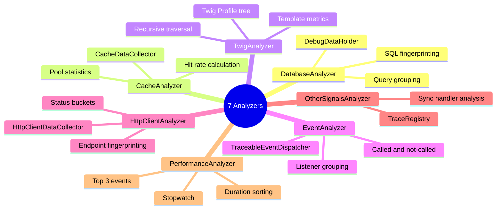
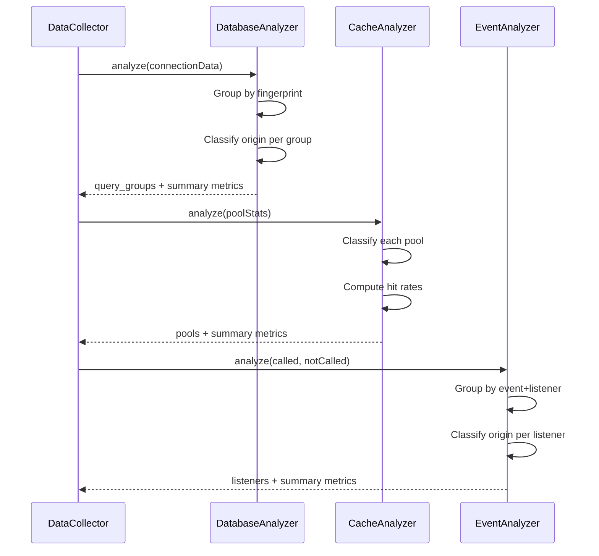

# Analyzers

[Docs Hub](../README.md) / [Components](index.md) / **Analyzers**

Seven stateless, `final readonly` analyzer classes that transform raw profiler data into structured signals.

## Overview



## Summary

| Analyzer               | Data Source                | Output Key        | Config Params                                                                         | Origin Strategy                     |
|------------------------|----------------------------|-------------------|---------------------------------------------------------------------------------------|-------------------------------------|
| `DatabaseAnalyzer`     | `DebugDataHolder`          | `db`              | `infra_db_tables`                                                                     | Table prefix + SQL pattern matching |
| `CacheAnalyzer`        | `CacheDataCollector`       | `cache`           | `app_cache_pool_prefixes`, `profiler_cache_pool_prefixes`                             | Pool name prefix matching           |
| `TwigAnalyzer`         | `Twig\Profiler\Profile`    | `twig`            | `profiler_template_prefixes`                                                          | Template name prefix matching       |
| `EventAnalyzer`        | `TraceableEventDispatcher` | `events`          | `app_namespace_prefix`, `profiler_event_namespace_prefixes`, `profiler_event_classes` | Namespace prefix + class list       |
| `HttpClientAnalyzer`   | `HttpClientDataCollector`  | `http`            | *(none)*                                                                              | All calls classified as `app`       |
| `OtherSignalsAnalyzer` | `TraceRegistry`            | `other.messenger` | `app_namespace_prefix`                                                                | Handler namespace prefix            |
| `PerformanceAnalyzer`  | `Stopwatch`                | `performance`     | *(none)*                                                                              | No origin classification            |

---

## DatabaseAnalyzer

`src/Analyzer/DatabaseAnalyzer.php`

### Public API

```php
public function analyze(array $connectionData): array
```

**Input:** `array<string, array<int, array<string, mixed>>>` — keyed by connection name, each containing query arrays with `sql`, `executionMS`, `params`, `types`.

**Output keys:** `query_groups`, `total_queries`, `total_db_ms`, `app_queries`, `app_db_ms`, `app_patterns`, `infra_queries`, `infra_db_ms`, `infra_patterns`, `profiler_queries`, `profiler_db_ms`, `profiler_patterns`, `connections`, `unique_patterns`, `select_count`, `insert_count`, `update_count`, `delete_count`, `other_count`.

### Classification Rules

1. SQL contains `CURRENT_DATABASE()` or `CURRENT_SCHEMA()` &rarr; **infra**
2. Table name starts with `pg_` or `information_schema` &rarr; **infra**
3. Table name matches `infra_db_tables` config &rarr; **infra**
4. Otherwise &rarr; **app**

### Query Grouping

Queries are grouped by `connectionName::fingerprint` where fingerprint = `md5(normalized SQL)`. Each group tracks count, total/max/min/avg ms, kind (SELECT/INSERT/UPDATE/DELETE/OTHER), and tables.

---

## CacheAnalyzer

`src/Analyzer/CacheAnalyzer.php`

### Public API

```php
public function analyze(array $poolStatistics): array
```

**Input:** `array<string, array{calls, reads, writes, deletes, hits, misses, time}>` from `CacheDataCollector::getStatistics()`.

**Output keys:** `pools`, `total_cache_calls`, `total_cache_ms`, `total_hits`, `total_misses`, `total_reads`, `total_writes`, `total_deletes`, `pool_count`, `global_hit_rate`, `app_cache_calls`, `app_cache_ms`, `app_hits`, `app_reads`, `app_misses`, `app_writes`, `app_deletes`, `infra_cache_calls`, `infra_cache_ms`, `profiler_cache_calls`, `profiler_cache_ms`.

### Classification Rules

1. Pool name starts with `profiler_cache_pool_prefixes` &rarr; **profiler**
2. Pool name starts with `app_cache_pool_prefixes` &rarr; **app**
3. Otherwise &rarr; **infra**

---

## TwigAnalyzer

`src/Analyzer/TwigAnalyzer.php`

### Public API

```php
public function analyze(Profile $profile): array
```

**Input:** `Twig\Profiler\Profile` root node.

**Output keys:** `templates`, `total_twig_ms`, `total_renders`, `unique_templates`, `app_renders`, `app_twig_ms`, `infra_renders`, `infra_twig_ms`, `profiler_renders`, `profiler_twig_ms`.

### Classification Rules

1. Template name starts with `profiler_template_prefixes` &rarr; **profiler**
2. Otherwise &rarr; **app**

### Profile Traversal

Recursively walks the Profile tree, collecting per-template render counts and durations. Templates are aggregated by name across all nested occurrences.

---

## EventAnalyzer

`src/Analyzer/EventAnalyzer.php`

### Public API

```php
public function analyze(array $calledListeners, array $notCalledListeners): array
```

**Input:** Called listeners `array<int, array{event, pretty, time}>` and not-called `array<int, array{event, pretty}>`.

**Output keys:** `listeners`, `total_listener_calls`, `total_events_ms`, `not_called_count`, `unique_listeners`, `unique_events`, `app_listener_calls`, `app_events_ms`, `infra_listener_calls`, `infra_events_ms`, `profiler_listener_calls`, `profiler_events_ms`.

### Classification Rules

1. Listener class starts with `profiler_event_namespace_prefixes` &rarr; **profiler**
2. Listener class in `profiler_event_classes` list &rarr; **profiler**
3. Listener class starts with `app_namespace_prefix` &rarr; **app**
4. Otherwise &rarr; **infra**

---

## HttpClientAnalyzer

`src/Analyzer/HttpClientAnalyzer.php`

### Public API

```php
public function analyze(array $clientsData): array
```

**Input:** `array<string, array<int, array{method, url, http_code, duration}>>` keyed by HTTP client name.

**Output keys:** `calls`, `total_http_calls`, `total_http_ms`, `app_http_calls`, `app_http_ms`, `profiler_http_calls`, `profiler_http_ms`.

### Endpoint Fingerprinting

URLs are parsed into `method + host + pathPattern`. Numeric path segments are replaced with `{id}` (e.g., `/users/123/posts/456` becomes `/users/{id}/posts/{id}`). Status codes are bucketed as `2xx`, `3xx`, `4xx`, `5xx`.

### Classification

All HTTP calls are classified as **app** (no infra/profiler distinction).

---

## OtherSignalsAnalyzer

`src/Analyzer/OtherSignalsAnalyzer.php`

### Public API

```php
public function analyze(array $records): array
```

**Input:** `array<int, array<string, mixed>>` from `TraceRegistry::getRecords()`.

**Output:** `array{messenger: array{sync_handlers, total_sync_ms, sync_count, app_sync_ms, app_sync_count, infra_sync_ms, infra_sync_count, profiler_sync_ms, profiler_sync_count}}`.

### Classification Rules

1. Handler class starts with `app_namespace_prefix` &rarr; **app**
2. Otherwise &rarr; **infra**

Only synchronous handlers (`is_handled_sync === true`) are analyzed.

---

## PerformanceAnalyzer

`src/Analyzer/PerformanceAnalyzer.php`

### Public API

```php
public function analyze(array $events, float $requestDuration): array
```

**Input:** Pre-serialized Stopwatch events `array<int, array{name, category, duration, memory, start_time, end_time, period_count}>` and total request duration in ms.

**Output keys:** `events` (enriched with `percent_of_total`), `request_duration`, `event_count`, `top_three`.

### Behavior

Filters out `__section__` events, sorts by duration descending, enriches each event with `percent_of_total`, and extracts top 3 by duration.

---

## Class Diagram

```mermaid
classDiagram
    class DatabaseAnalyzer {
        <<final readonly>>
        -SqlNormalizer sqlNormalizer
        -array infraTables
        +analyze(connectionData) array
    }
    class CacheAnalyzer {
        <<final readonly>>
        -array appPoolPrefixes
        -array profilerPoolPrefixes
        +analyze(poolStatistics) array
    }
    class TwigAnalyzer {
        <<final readonly>>
        -array profilerTemplatePrefixes
        +analyze(Profile) array
    }
    class EventAnalyzer {
        <<final readonly>>
        -string appNamespacePrefix
        -array profilerNamespacePrefixes
        -array profilerListenerClasses
        +analyze(called, notCalled) array
    }
    class HttpClientAnalyzer {
        <<final readonly>>
        +analyze(clientsData) array
    }
    class OtherSignalsAnalyzer {
        <<final readonly>>
        -string appNamespacePrefix
        +analyze(records) array
    }
    class PerformanceAnalyzer {
        <<final readonly>>
        +analyze(events, requestDuration) array
    }
```



## DataCollector Calling Analyzers



---

[&larr; AdvisorEngine](advisor-engine.md) | [Next: Enums &rarr;](enums.md)
