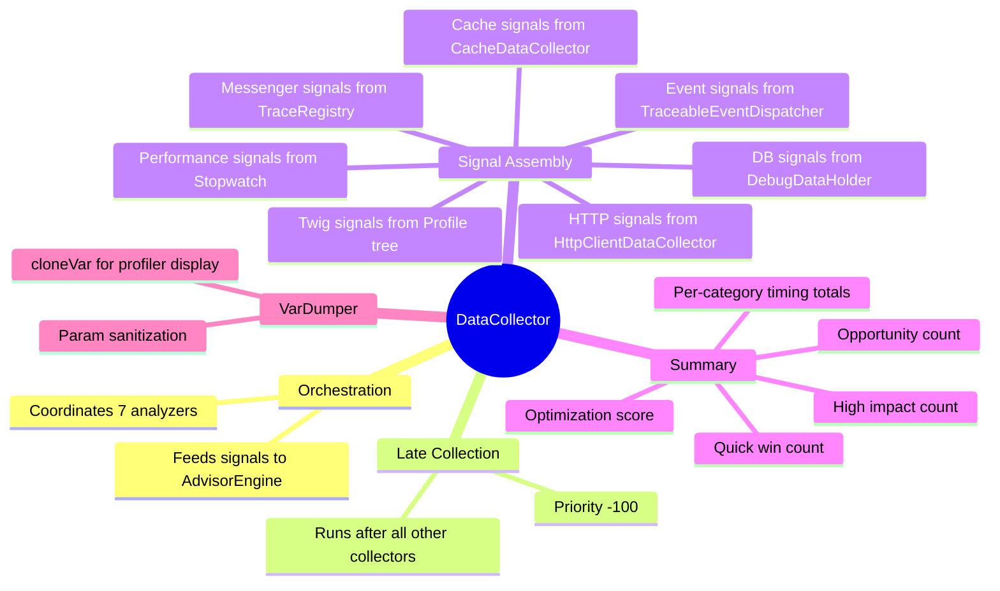
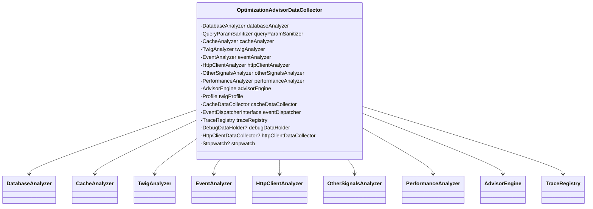
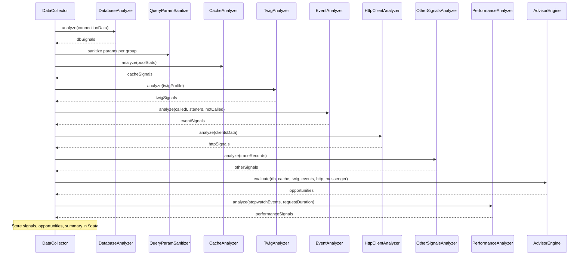

# OptimizationAdvisorDataCollector

[Docs Hub](../README.md) / [Components](index.md) / **DataCollector**

## Responsibilities

## Public API

| Method                                   | Return Type | Description                                                     |
|------------------------------------------|-------------|-----------------------------------------------------------------|
| `collect(Request, Response, ?Throwable)` | `void`      | Stores route, controller, method, URI                           |
| `lateCollect()`                          | `void`      | Runs all analyzers, evaluates opportunities, builds summary     |
| `getName()`                              | `string`    | Returns `'optimization_advisor'`                                |
| `getTemplate()`                          | `string`    | Returns Twig template path                                      |
| `reset()`                                | `void`      | Resets data and TraceRegistry                                   |
| `getCorrelationId()`                     | `string`    | Returns correlation ID                                          |
| `getOrigin()`                            | `array`     | Returns `{route, controller, method, uri}`                      |
| `getSignals()`                           | `array`     | Returns all 7 signal categories                                 |
| `getOpportunities()`                     | `array`     | Returns all scored opportunities                                |
| `getSummary()`                           | `array`     | Returns summary metrics                                         |
| `getDbSignals()`                         | `array`     | Returns database signals                                        |
| `getCacheSignals()`                      | `array`     | Returns cache signals                                           |
| `getTwigSignals()`                       | `array`     | Returns Twig signals                                            |
| `getEventSignals()`                      | `array`     | Returns event signals                                           |
| `getHttpSignals()`                       | `array`     | Returns HTTP client signals                                     |
| `getOtherSignals()`                      | `array`     | Returns Messenger signals                                       |
| `getPerformanceSignals()`                | `array`     | Returns Stopwatch signals                                       |
| `getQuickWins()`                         | `array`     | Returns quick wins (deduplicated by code, highest ROI per code) |
| `getHighImpactOpportunities()`           | `array`     | Returns opportunities with `impact >= 4`                        |
| `getTopOpportunities(int $limit = 5)`    | `array`     | Returns top N opportunities by ROI                              |
| `getRiskyChanges()`                      | `array`     | Returns opportunities with `risk = high`                        |

## Dependencies

## lateCollect() Flow

## Key Behaviors

### Late Collection

Uses `#[AutoconfigureTag('data_collector', ['priority' => -100])]` and implements `LateDataCollectorInterface` to ensure all other Symfony profiler collectors have finished before analysis begins.

### Parameter Sanitization

DB query params are processed through `QueryParamSanitizer` and then `cloneVar()` for safe VarDumper display in the profiler panel. Complex types (objects, resources) are converted to display-safe placeholders.

### Optional Service Degradation

Three services use `nullOnInvalid()` wiring and degrade gracefully:

| Service                      | When Absent               |
|------------------------------|---------------------------|
| `doctrine.debug_data_holder` | Empty DB section          |
| `data_collector.http_client` | Empty HTTP section        |
| `debug.stopwatch`            | Empty performance section |

---

[&larr; Components](index.md) | [Next: AdvisorEngine &rarr;](advisor-engine.md)
