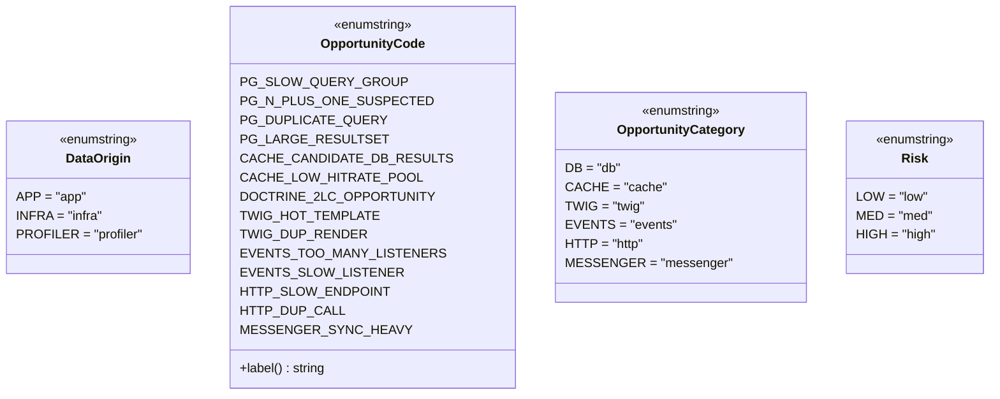

# Enums

[Docs Hub](../README.md) / [Components](index.md) / **Enums**

Four backed string enums provide type-safe constants throughout the bundle.

## DataOrigin

`src/Enum/DataOrigin.php` — Signal source classification.

| Case       | Value      | Description                                |
|------------|------------|--------------------------------------------|
| `APP`      | `app`      | Application code (generates opportunities) |
| `INFRA`    | `infra`    | Framework/library infrastructure           |
| `PROFILER` | `profiler` | Profiler overhead                          |

## OpportunityCode

`src/Enum/OpportunityCode.php` — 14 detection rule identifiers with human-readable labels.

| Case                         | Value                        | Category  | Label                            |
|------------------------------|------------------------------|-----------|----------------------------------|
| `PG_SLOW_QUERY_GROUP`        | `PG_SLOW_QUERY_GROUP`        | db        | Slow query group detected        |
| `PG_N_PLUS_ONE_SUSPECTED`    | `PG_N_PLUS_ONE_SUSPECTED`    | db        | N+1 query pattern suspected      |
| `PG_DUPLICATE_QUERY`         | `PG_DUPLICATE_QUERY`         | db        | Duplicate query executed         |
| `PG_LARGE_RESULTSET`         | `PG_LARGE_RESULTSET`         | db        | Large resultset suspected        |
| `CACHE_CANDIDATE_DB_RESULTS` | `CACHE_CANDIDATE_DB_RESULTS` | cache     | Cache candidate: repeated SELECT |
| `CACHE_LOW_HITRATE_POOL`     | `CACHE_LOW_HITRATE_POOL`     | cache     | Low hit-rate cache pool          |
| `DOCTRINE_2LC_OPPORTUNITY`   | `DOCTRINE_2LC_OPPORTUNITY`   | db        | Doctrine 2LC opportunity         |
| `TWIG_HOT_TEMPLATE`          | `TWIG_HOT_TEMPLATE`          | twig      | Hot Twig template                |
| `TWIG_DUP_RENDER`            | `TWIG_DUP_RENDER`            | twig      | Duplicate Twig render            |
| `EVENTS_TOO_MANY_LISTENERS`  | `EVENTS_TOO_MANY_LISTENERS`  | events    | Excessive listener calls         |
| `EVENTS_SLOW_LISTENER`       | `EVENTS_SLOW_LISTENER`       | events    | Slow event listener              |
| `HTTP_SLOW_ENDPOINT`         | `HTTP_SLOW_ENDPOINT`         | http      | Slow HTTP endpoint               |
| `HTTP_DUP_CALL`              | `HTTP_DUP_CALL`              | http      | Duplicate HTTP call              |
| `MESSENGER_SYNC_HEAVY`       | `MESSENGER_SYNC_HEAVY`       | messenger | Heavy sync Messenger handler     |

### Methods

| Method    | Return   | Description                       |
|-----------|----------|-----------------------------------|
| `label()` | `string` | Human-readable label for the code |

## OpportunityCategory

`src/Enum/OpportunityCategory.php` — 6 signal categories.

| Case        | Value       |
|-------------|-------------|
| `DB`        | `db`        |
| `CACHE`     | `cache`     |
| `TWIG`      | `twig`      |
| `EVENTS`    | `events`    |
| `HTTP`      | `http`      |
| `MESSENGER` | `messenger` |

## Risk

`src/Enum/Risk.php` — Implementation risk levels.

| Case   | Value  | Description                                 |
|--------|--------|---------------------------------------------|
| `LOW`  | `low`  | Safe to implement with minimal side effects |
| `MED`  | `med`  | Moderate risk; test on staging recommended  |
| `HIGH` | `high` | Significant risk; thorough testing required |

## Class Diagram

## Cross-Reference

| Enum                  | Used By                                                                                        |
|-----------------------|------------------------------------------------------------------------------------------------|
| `DataOrigin`          | All 7 analyzers (origin classification), `AdvisorEngine` (app-only filtering)                  |
| `OpportunityCode`     | `AdvisorEngine` (rule identification), `DataCollector` (quick win deduplication via `label()`) |
| `OpportunityCategory` | `AdvisorEngine` (opportunity categorization), `OptimizationAdvisorTool` (category filtering)   |
| `Risk`                | `AdvisorEngine` (risk assignment), `DataCollector` (risky changes filtering)                   |

---

[&larr; Analyzers](analyzers.md) | [Next: SQL Utilities &rarr;](sql-utilities.md)
