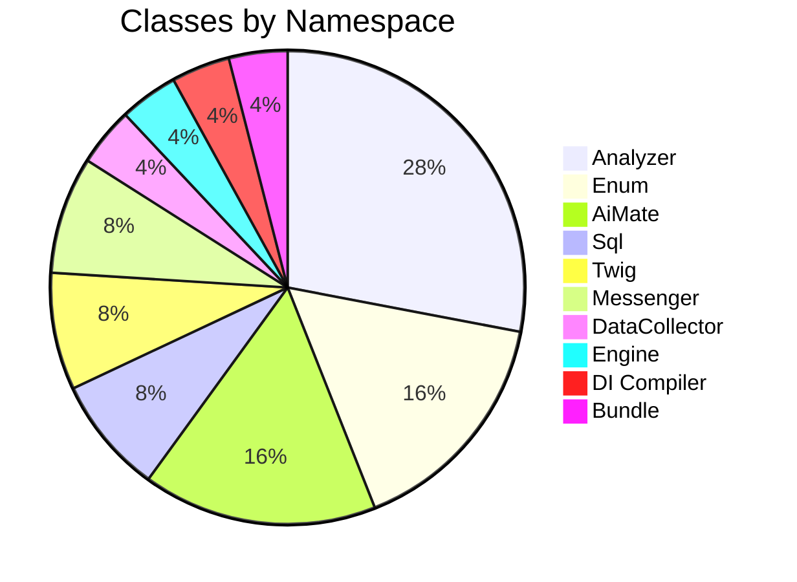
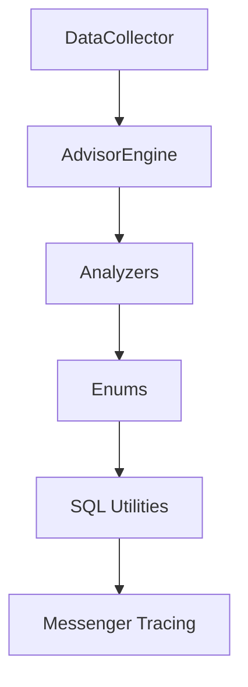

# Component Catalog

[Docs Hub](../README.md) / **Components**

## Class Distribution

## Component Pages

| Page                                      | Classes Covered                                                             |
|-------------------------------------------|-----------------------------------------------------------------------------|
| [DataCollector](data-collector.md)        | `OptimizationAdvisorDataCollector`                                          |
| [AdvisorEngine](advisor-engine.md)        | `AdvisorEngine` (14 detection rules)                                        |
| [Analyzers](analyzers.md)                 | 7 analyzer classes                                                          |
| [Enums](enums.md)                         | `DataOrigin`, `OpportunityCode`, `OpportunityCategory`, `Risk`              |
| [SQL Utilities](sql-utilities.md)         | `SqlNormalizer`, `QueryParamSanitizer`                                      |
| [Messenger Tracing](messenger-tracing.md) | `TraceRegistry`, `MessageTracingMiddleware`, `MessageTracingMiddlewarePass` |

## Class Hierarchy

```mermaid
classDiagram
    class AbstractDataCollector {
        <<abstract>>
    }
    class LateDataCollectorInterface {
        <<interface>>
    }
    class OptimizationAdvisorDataCollector {
        +collect()
        +lateCollect()
        +getOpportunities()
        +getSummary()
    }
    AbstractDataCollector <|-- OptimizationAdvisorDataCollector
    LateDataCollectorInterface <|.. OptimizationAdvisorDataCollector

    class AdvisorEngine {
        +evaluate()
    }

    class DatabaseAnalyzer { +analyze() }
    class CacheAnalyzer { +analyze() }
    class TwigAnalyzer { +analyze() }
    class EventAnalyzer { +analyze() }
    class HttpClientAnalyzer { +analyze() }
    class OtherSignalsAnalyzer { +analyze() }
    class PerformanceAnalyzer { +analyze() }

    class ResetInterface {
        <<interface>>
    }
    class TraceRegistry {
        +append()
        +getRecords()
        +reset()
    }
    ResetInterface <|.. TraceRegistry

    class MiddlewareInterface {
        <<interface>>
    }
    class MessageTracingMiddleware {
        +handle()
    }
    MiddlewareInterface <|.. MessageTracingMiddleware

    class CompilerPassInterface {
        <<interface>>
    }
    class MessageTracingMiddlewarePass {
        +process()
    }
    CompilerPassInterface <|.. MessageTracingMiddlewarePass

    class DataOrigin { <<enum>> APP; INFRA; PROFILER }
    class OpportunityCode { <<enum>> 14 cases }
    class OpportunityCategory { <<enum>> DB; CACHE; TWIG; EVENTS; HTTP; MESSENGER }
    class Risk { <<enum>> LOW; MED; HIGH }
```

## Reading Path

---

[&larr; Glossary](../overview/glossary.md) | [Next: DataCollector &rarr;](data-collector.md)
