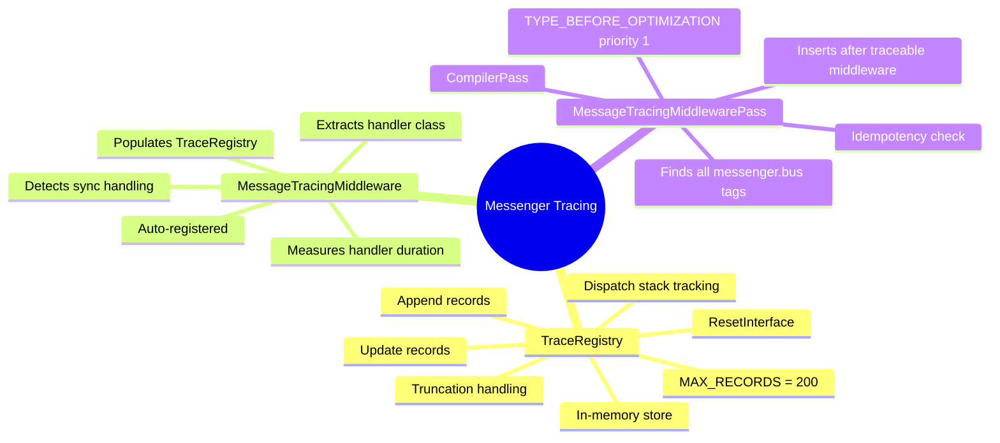
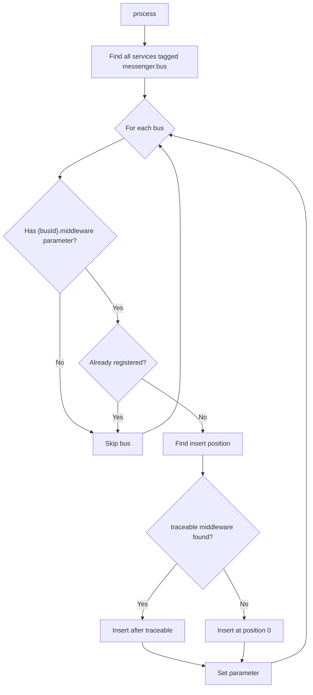
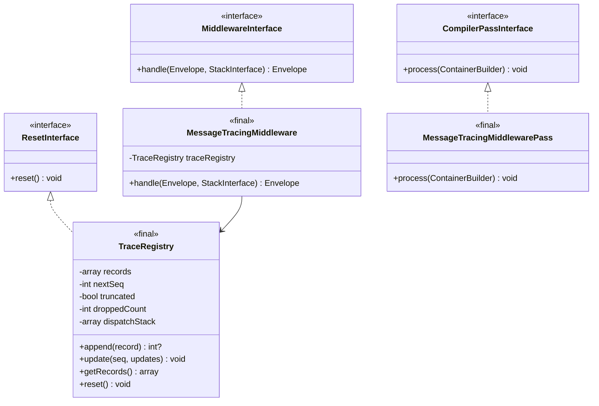
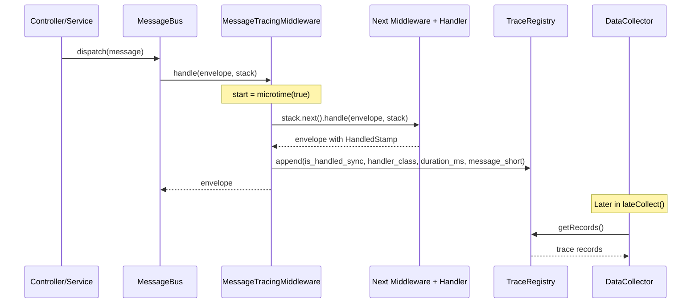

# Messenger Tracing

[Docs Hub](../README.md) / [Components](index.md) / **Messenger Tracing**

Three classes that enable automatic Messenger handler tracing without manual configuration.

## Responsibilities

## TraceRegistry

`src/Messenger/TraceRegistry.php`

### Public API

| Method                | Signature                                | Description                                                      |
|-----------------------|------------------------------------------|------------------------------------------------------------------|
| `append`              | `append(array $record): ?int`            | Appends a record, returns sequence number or `null` if truncated |
| `update`              | `update(int $seq, array $updates): void` | Merges updates into existing record                              |
| `pushDispatchStack`   | `pushDispatchStack(int $seq): void`      | Pushes sequence to dispatch stack (nested dispatch tracking)     |
| `popDispatchStack`    | `popDispatchStack(): void`               | Pops from dispatch stack                                         |
| `getCurrentParentSeq` | `getCurrentParentSeq(): ?int`            | Returns current parent sequence or `null`                        |
| `getCurrentDepth`     | `getCurrentDepth(): int`                 | Returns dispatch nesting depth                                   |
| `getRecords`          | `getRecords(): array`                    | Returns all stored records                                       |
| `getRecordCount`      | `getRecordCount(): int`                  | Returns number of stored records                                 |
| `isTruncated`         | `isTruncated(): bool`                    | Whether max records limit was reached                            |
| `getDroppedCount`     | `getDroppedCount(): int`                 | Number of dropped records after truncation                       |
| `reset`               | `reset(): void`                          | Clears all state                                                 |

### Constants

| Constant      | Value | Description                              |
|---------------|-------|------------------------------------------|
| `MAX_RECORDS` | `200` | Maximum stored trace records per request |

---

## MessageTracingMiddleware

`src/Messenger/Middleware/MessageTracingMiddleware.php`

### Public API

| Method   | Signature                                                     | Description                                        |
|----------|---------------------------------------------------------------|----------------------------------------------------|
| `handle` | `handle(Envelope $envelope, StackInterface $stack): Envelope` | Passes to next middleware, then records trace data |

### Recorded Fields

| Field                 | Type      | Source                                  |
|-----------------------|-----------|-----------------------------------------|
| `is_handled_sync`     | `bool`    | `HandledStamp` present on envelope      |
| `handler_class`       | `?string` | `HandledStamp::getHandlerName()` (FQCN) |
| `handler_duration_ms` | `float`   | `(microtime(true) - start) * 1000.0`    |
| `message_short`       | `string`  | Short class name of dispatched message  |

---

## MessageTracingMiddlewarePass

`src/DependencyInjection/Compiler/MessageTracingMiddlewarePass.php`

### Registration

Registered in `OptimizationAdvisorBundle::build()` with:

- Pass type: `PassConfig::TYPE_BEFORE_OPTIMIZATION`
- Priority: `1`
- Condition: Only when `Symfony\Component\Messenger\Middleware\MiddlewareInterface` exists

### Logic

### Idempotency

The pass checks if `MessageTracingMiddleware::class` already exists in the middleware list. If found, the bus is skipped to prevent duplicate registration.

---

## Class Diagram

## Dispatch Flow

---

[&larr; SQL Utilities](sql-utilities.md) | [Next: Configuration &rarr;](../configuration/index.md)
