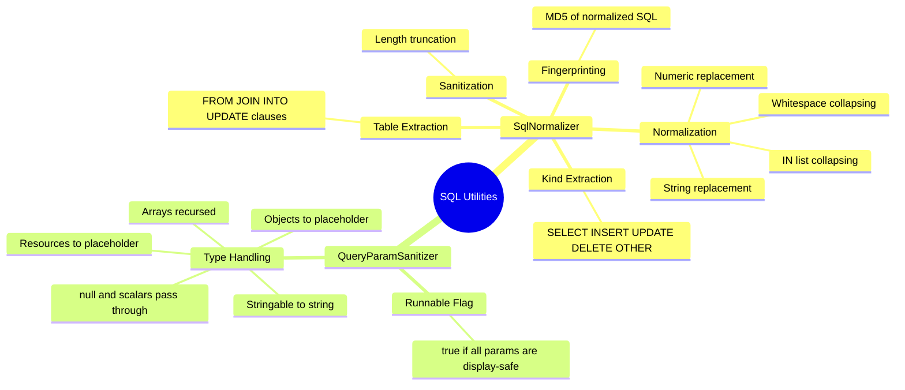
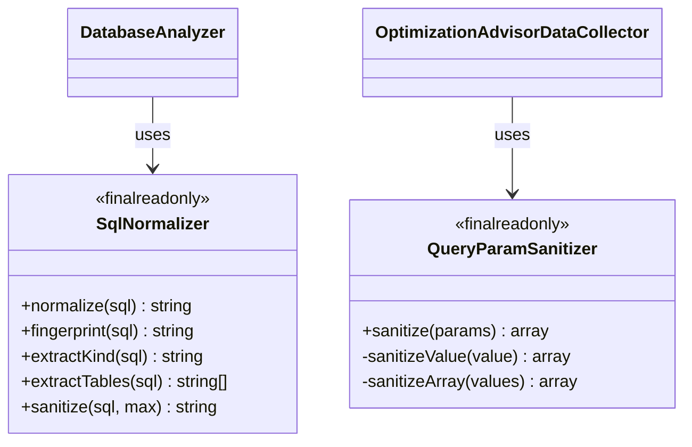

# SQL Utilities

[Docs Hub](../README.md) / [Components](index.md) / **SQL Utilities**

Two utility classes for SQL processing and parameter sanitization used by `DatabaseAnalyzer` and `OptimizationAdvisorDataCollector`.

## Responsibilities



## SqlNormalizer

`src/Sql/SqlNormalizer.php`

### Public API

| Method          | Signature                                       | Description                                                                                                                        |
|-----------------|-------------------------------------------------|------------------------------------------------------------------------------------------------------------------------------------|
| `normalize`     | `normalize(string $sql): string`                | Normalizes SQL: collapses whitespace, replaces string literals with `?`, numeric literals with `?`, collapses IN lists to `IN (?)` |
| `fingerprint`   | `fingerprint(string $sql): string`              | Returns `md5(normalize($sql))`                                                                                                     |
| `extractKind`   | `extractKind(string $sql): string`              | Returns first keyword: `SELECT`, `INSERT`, `UPDATE`, `DELETE`, or `OTHER`                                                          |
| `extractTables` | `extractTables(string $sql): array`             | Extracts table names from `FROM`, `JOIN`, `INTO`, `UPDATE` clauses                                                                 |
| `sanitize`      | `sanitize(string $sql, int $max = 240): string` | Normalizes and truncates to `$max` characters (appends `...` if truncated)                                                         |

### Normalization Rules

1. Collapse all whitespace to single space, trim
2. Replace `'...'` quoted strings with `?`
3. Replace standalone numeric literals with `?`
4. Collapse `IN (?, ?, ?, ...)` to `IN (?)`

### Example

```
Input:  SELECT * FROM users WHERE email = 'john@example.com' AND id IN (1, 2, 3)
Output: SELECT * FROM users WHERE email = ? AND id IN (?)
```

---

## QueryParamSanitizer

`src/Sql/QueryParamSanitizer.php`

### Public API

| Method     | Signature                                                       | Description                                                                               |
|------------|-----------------------------------------------------------------|-------------------------------------------------------------------------------------------|
| `sanitize` | `sanitize(array $params): array{params: array, runnable: bool}` | Sanitizes each param for profiler display. Returns sanitized params and a `runnable` flag |

### Type Handling

| Input Type                          | Output                 | Runnable?           |
|-------------------------------------|------------------------|---------------------|
| `null`                              | `null`                 | yes                 |
| `scalar` (bool, int, float, string) | unchanged              | yes                 |
| `Stringable` object                 | `(string) $value`      | yes                 |
| `object`                            | `{object(ClassName)}`  | no                  |
| `resource`                          | `/* Resource(type) */` | no                  |
| `array`                             | recursively sanitized  | depends on contents |
| other                               | `{unknown}`            | no                  |

The `runnable` flag is `false` if any param in the set is not display-safe.

## Class Diagram



---

[&larr; Enums](enums.md) | [Next: Messenger Tracing &rarr;](messenger-tracing.md)
