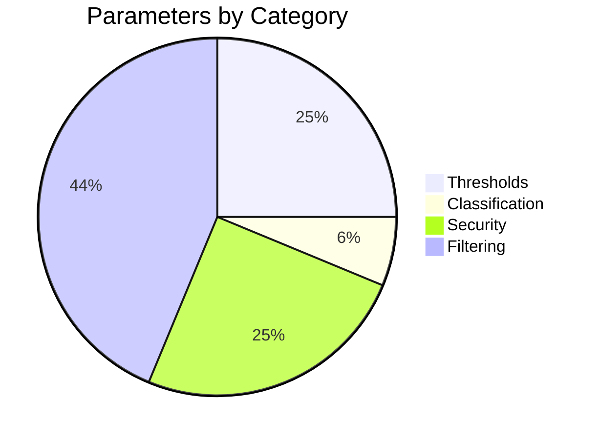

# Configuration Reference

[Docs Hub](../README.md) / **Configuration**

All 16 configuration parameters with types, defaults, and descriptions.

## Parameter Distribution



## Full YAML Config Tree

```yaml
optimization_advisor:

    # --- Thresholds ---
    thresholds:
        slow_query_ms: 30.0              # float — min total ms for slow query group
        n_plus_one_count: 10             # int   — min identical fast SELECTs for N+1
        slow_listener_ms: 10.0           # float — min ms for slow event listener
        max_items: 200                   # int   — max opportunities per request

    # --- Classification ---
    app_namespace_prefix: 'App\'         # string — root namespace for app classification

    # --- Security ---
    redact_sensitive_data: true           # bool   — enable/disable MCP redaction
    sensitive_param_patterns: # string[] — key substring match (case-insensitive)
        - email
        - password
        - passwd
        - token
        - secret
        - auth
        - credential
        - phone
        - address
        - ssn
        - card
        - iban
    sensitive_value_patterns: # string[] — regex match on values (fail-closed)
        - '[^@\s]+@[^@\s]+\.[^@\s]+'    # email addresses
    sensitive_query_params: # string[] — exact query param name (case-insensitive)
        - token
        - api_key
        - apikey
        - secret
        - password
        - auth
        - access_token
        - refresh_token
        - session_id
        - _token
        - email
        - session
        - cookie

    # --- Filtering ---
    infra_db_tables: # string[] — DB tables classified as infrastructure
        - doctrine_migration_versions
    app_cache_pool_prefixes: # string[] — cache pools classified as app
        - cache.app
        - cache.doctrine.result
        - cache.doctrine.orm
    profiler_cache_pool_prefixes: # string[] — cache pools excluded as profiler
        - cache.profiler
    profiler_template_prefixes: # string[] — Twig templates excluded as profiler
        - '@WebProfiler/'
    profiler_event_namespace_prefixes: # string[] — listener namespaces excluded as profiler
        - 'Symfony\Bundle\WebProfilerBundle\'
    profiler_event_classes: # string[] — specific listener classes excluded as profiler
        - 'Symfony\Component\HttpKernel\EventListener\ProfilerListener'
```

## Thresholds (4)

| Parameter                     | Type    | Default | Used By                                             |
|-------------------------------|---------|---------|-----------------------------------------------------|
| `thresholds.slow_query_ms`    | `float` | `30.0`  | `AdvisorEngine` — `PG_SLOW_QUERY_GROUP` trigger     |
| `thresholds.n_plus_one_count` | `int`   | `10`    | `AdvisorEngine` — `PG_N_PLUS_ONE_SUSPECTED` trigger |
| `thresholds.slow_listener_ms` | `float` | `10.0`  | `AdvisorEngine` — `EVENTS_SLOW_LISTENER` trigger    |
| `thresholds.max_items`        | `int`   | `200`   | `AdvisorEngine` — opportunity count cap             |

## Classification (1)

| Parameter              | Type     | Default | Used By                                                                |
|------------------------|----------|---------|------------------------------------------------------------------------|
| `app_namespace_prefix` | `string` | `App\`  | `EventAnalyzer`, `OtherSignalsAnalyzer` — app vs. infra classification |

## Security (4)

| Parameter                  | Type       | Default                                                                                                                     | Used By                                                              |
|----------------------------|------------|-----------------------------------------------------------------------------------------------------------------------------|----------------------------------------------------------------------|
| `redact_sensitive_data`    | `bool`     | `true`                                                                                                                      | `SecurityRedactor` — master enable/disable                           |
| `sensitive_param_patterns` | `string[]` | `[email, password, passwd, token, secret, auth, credential, phone, address, ssn, card, iban]`                               | `SecurityRedactor` — key substring match (case-insensitive)          |
| `sensitive_value_patterns` | `string[]` | `['[^@\s]+@[^@\s]+\.[^@\s]+']`                                                                                              | `SecurityRedactor` — regex match on string values                    |
| `sensitive_query_params`   | `string[]` | `[token, api_key, apikey, secret, password, auth, access_token, refresh_token, session_id, _token, email, session, cookie]` | `SecurityRedactor` — exact query param name match (case-insensitive) |

### Security Pattern Matching

**`sensitive_param_patterns`** — Case-insensitive **substring** match on parameter keys. If any pattern is a substring of the key, the value is redacted. Example: pattern `email` matches keys `user_email`, `email_address`, `email`.

**`sensitive_value_patterns`** — **Regex** patterns matched against string values. Uses `\x01` as regex delimiter to avoid conflicts with pattern content. **Fail-closed**: if a regex pattern is invalid (`preg_match` returns `false`), the value is redacted (not skipped).

**`sensitive_query_params`** — Case-insensitive **exact match** on URI query parameter names. Only the parameter name must match exactly (after lowercasing).

## Filtering (7)

| Parameter                           | Type       | Default                                                         | Used By                                                            |
|-------------------------------------|------------|-----------------------------------------------------------------|--------------------------------------------------------------------|
| `infra_db_tables`                   | `string[]` | `[doctrine_migration_versions]`                                 | `DatabaseAnalyzer` — tables classified as infra                    |
| `app_cache_pool_prefixes`           | `string[]` | `[cache.app, cache.doctrine.result, cache.doctrine.orm]`        | `CacheAnalyzer` — pools classified as app                          |
| `profiler_cache_pool_prefixes`      | `string[]` | `[cache.profiler]`                                              | `CacheAnalyzer` — pools classified as profiler                     |
| `profiler_template_prefixes`        | `string[]` | `[@WebProfiler/]`                                               | `TwigAnalyzer` — templates classified as profiler                  |
| `profiler_event_namespace_prefixes` | `string[]` | `[Symfony\Bundle\WebProfilerBundle\]`                           | `EventAnalyzer` — listener namespaces classified as profiler       |
| `profiler_event_classes`            | `string[]` | `[Symfony\Component\HttpKernel\EventListener\ProfilerListener]` | `EventAnalyzer` — specific listener classes classified as profiler |

> **Note:** Setting any array parameter replaces the defaults entirely. Include all values you need.

---

[&larr; Messenger Tracing](../components/messenger-tracing.md) | [Next: Configuration Examples &rarr;](examples.md)
