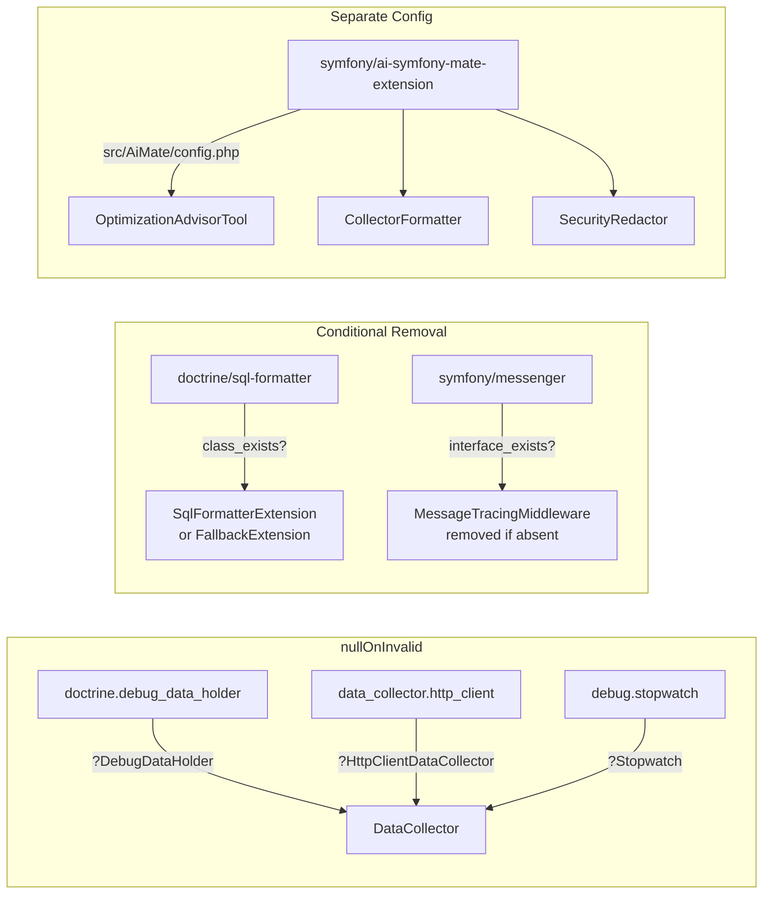

# Optional Dependencies

[Docs Hub](../README.md) / [Integration](index.md) / **Optional Dependencies**

The bundle gracefully degrades when optional packages are not installed.

## Dependency Matrix

| Package                             | What It Enables                                                      | Fallback When Absent                               | Wiring Strategy                                 |
|-------------------------------------|----------------------------------------------------------------------|----------------------------------------------------|-------------------------------------------------|
| `symfony/doctrine-bridge`           | Database query analysis via `DebugDataHolder`                        | Empty DB section                                   | `nullOnInvalid()`                               |
| `doctrine/sql-formatter`            | SQL syntax highlighting (`oi_prettify_sql`, `oi_format_sql`)         | `SqlFormatterFallbackExtension` (basic formatting) | Conditional `removeDefinition()`                |
| `symfony/http-client`               | HTTP client call analysis via `HttpClientDataCollector`              | Empty HTTP section                                 | `nullOnInvalid()`                               |
| `symfony/stopwatch`                 | Stopwatch performance timeline breakdown                             | Empty performance section                          | `nullOnInvalid()`                               |
| `symfony/messenger`                 | Automatic sync handler analysis via `MessageTracingMiddleware`       | Middleware removed, empty Messenger section        | Conditional `removeDefinition()` + CompilerPass |
| `symfony/ai-symfony-mate-extension` | MCP tool + collector formatter for AI assistants                     | No MCP integration                                 | Separate `src/AiMate/config.php`                |
| `symfony/cache`                     | Cache pool analysis (required at runtime via `data_collector.cache`) | Cache analysis unavailable                         | Required debug service                          |

## Service Wiring Patterns

## Per-Package Details

### symfony/doctrine-bridge

**Present:** `DebugDataHolder` is injected into the DataCollector. `DatabaseAnalyzer` processes all connection queries, groups by fingerprint, classifies origins, and feeds signals to the AdvisorEngine.

**Absent:** `$debugDataHolder` is `null`. The DataCollector skips DB signal generation. The panel shows an empty Database section.

### doctrine/sql-formatter

**Present:** `SqlFormatterExtension` is registered, providing `oi_prettify_sql`, `oi_format_sql`, and `oi_replace_query_params` Twig filters with full syntax highlighting.

**Absent:** `SqlFormatterFallbackExtension` is registered instead, providing basic formatting without syntax highlighting. Handled via `removeDefinition()` in `loadExtension()`.

### symfony/http-client

**Present:** `HttpClientDataCollector` is injected. `HttpClientAnalyzer` groups HTTP traces by endpoint fingerprint with status code bucketing.

**Absent:** `$httpClientDataCollector` is `null`. The panel shows an empty HTTP section.

### symfony/stopwatch

**Present:** `Stopwatch` is injected. `PerformanceAnalyzer` processes section events for a timeline breakdown with top 3 events.

**Absent:** `$stopwatch` is `null`. The panel shows an empty Performance section.

### symfony/messenger

**Present:** Two things happen:

1. `MessageTracingMiddleware` service definition is kept
2. `MessageTracingMiddlewarePass` (registered in `build()`) auto-inserts the middleware into all configured buses

**Absent:** Two things happen:

1. `MessageTracingMiddleware` definition is removed in `loadExtension()`
2. `MessageTracingMiddlewarePass` is not registered (guarded by `interface_exists(MiddlewareInterface::class)`)

### symfony/ai-symfony-mate-extension

**Present:** The `extra.ai-mate` section in `composer.json` triggers automatic discovery. `src/AiMate/config.php` registers:

- `SecurityRedactor` with bundle config parameters
- `OptimizationAdvisorCollectorFormatter` tagged as `ai_mate.profiler_collector_formatter`
- `OptimizationAdvisorTool` with `ProfilerDataProvider` and `SecurityRedactor` dependencies

**Absent:** The AiMate directory is excluded from the main service loader (`config/services.php`). No MCP integration is available.

---

[&larr; Installation](index.md) | [Next: Extending &rarr;](extending.md)
