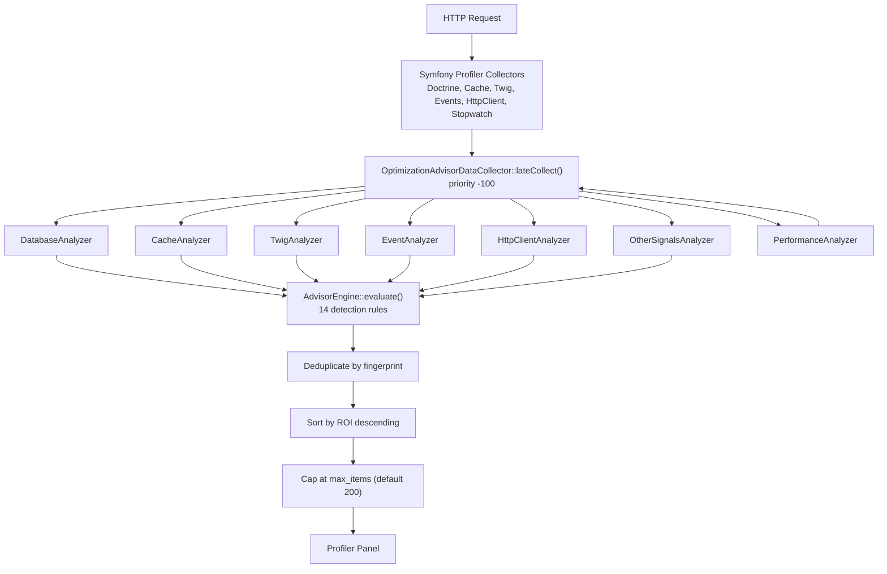
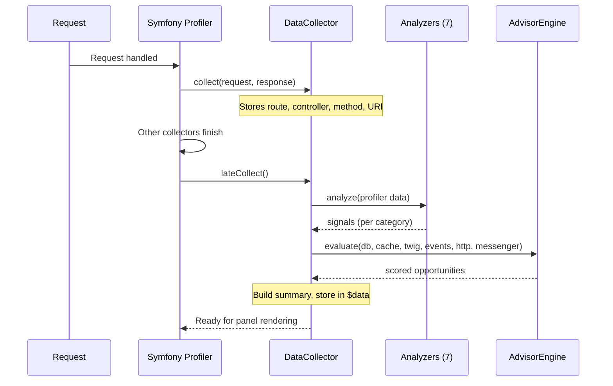
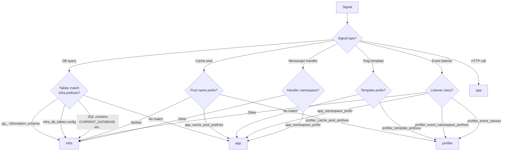

# Architecture

[Docs Hub](../README.md) / [Overview](index.md) / **Architecture**

## High-Level Data Flow

## Request Lifecycle

## Origin Classification

All signals are classified into three origins. Only **app** signals generate opportunities.

## Scoring Model

Each opportunity is scored on three dimensions (1-5 scale):

| Dimension      | Description                                          |
|----------------|------------------------------------------------------|
| **Impact**     | Expected performance improvement magnitude           |
| **Effort**     | Implementation work required                         |
| **Confidence** | Detection certainty (higher = fewer false positives) |

### Derived Metrics

| Metric                 | Formula                                | Purpose                 |
|------------------------|----------------------------------------|-------------------------|
| **ROI**                | `impact * confidence / effort`         | Sorting (highest first) |
| **Quick Win**          | `effort <= 2 AND confidence >= 4`      | Low-hanging fruit flag  |
| **High Impact**        | `impact >= 4`                          | High-value change flag  |
| **Fingerprint**        | `md5(code + "\|" + evidence)`          | Deduplication key       |
| **Optimization Score** | `100 - SUM(impact * confidence * 0.5)` | Request health (0-100)  |

## Signal Flow Summary

| Analyzer             | Data Source                | Output Key    | Detection Rules                                                                                                                            |
|----------------------|----------------------------|---------------|--------------------------------------------------------------------------------------------------------------------------------------------|
| DatabaseAnalyzer     | `DebugDataHolder`          | `db`          | PG_SLOW_QUERY_GROUP, PG_N_PLUS_ONE_SUSPECTED, PG_DUPLICATE_QUERY, PG_LARGE_RESULTSET, CACHE_CANDIDATE_DB_RESULTS, DOCTRINE_2LC_OPPORTUNITY |
| CacheAnalyzer        | `CacheDataCollector`       | `cache`       | CACHE_LOW_HITRATE_POOL                                                                                                                     |
| TwigAnalyzer         | `Twig\Profiler\Profile`    | `twig`        | TWIG_HOT_TEMPLATE, TWIG_DUP_RENDER                                                                                                         |
| EventAnalyzer        | `TraceableEventDispatcher` | `events`      | EVENTS_TOO_MANY_LISTENERS, EVENTS_SLOW_LISTENER                                                                                            |
| HttpClientAnalyzer   | `HttpClientDataCollector`  | `http`        | HTTP_SLOW_ENDPOINT, HTTP_DUP_CALL                                                                                                          |
| OtherSignalsAnalyzer | `TraceRegistry`            | `other`       | MESSENGER_SYNC_HEAVY                                                                                                                       |
| PerformanceAnalyzer  | `Stopwatch`                | `performance` | *(informational only)*                                                                                                                     |

---

[&larr; Overview](index.md) | [Next: Tech Stack &rarr;](tech-stack.md)
