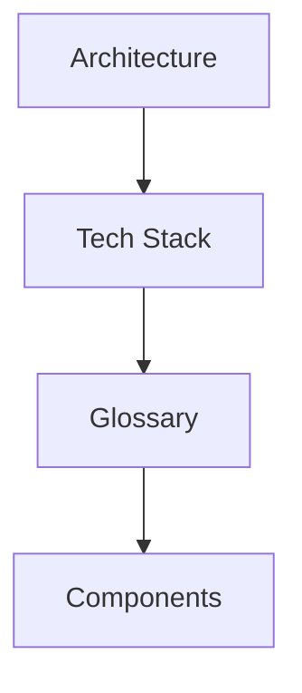

# Overview

[Docs Hub](../README.md) / **Overview**

This section covers the high-level architecture, technology stack, and terminology used throughout the bundle.

## Section Contents

| Document                        | Description                                                        |
|---------------------------------|--------------------------------------------------------------------|
| [Architecture](architecture.md) | Data flow, request lifecycle, origin classification, scoring model |
| [Tech Stack](tech-stack.md)     | Required, dev, and optional dependencies; CI matrix                |
| [Glossary](glossary.md)         | Key terms and concepts                                             |

## Reading Path

## Related Sections

- [Components](../components/index.md) — Detailed class reference
- [Configuration](../configuration/index.md) — All 16 parameters
- [ADRs](../architecture/adr/index.md) — Architectural decision records

---

[&larr; Docs Hub](../README.md) | [Next: Architecture &rarr;](architecture.md)
